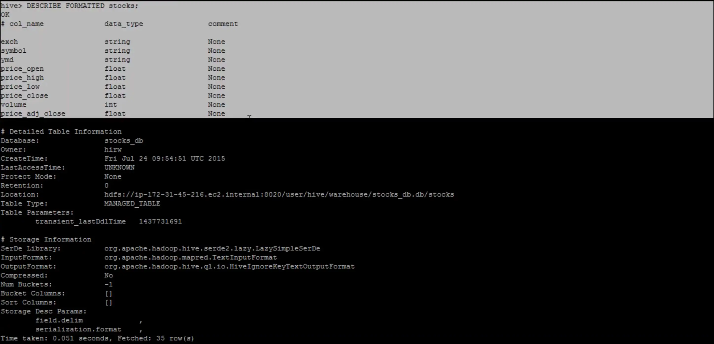
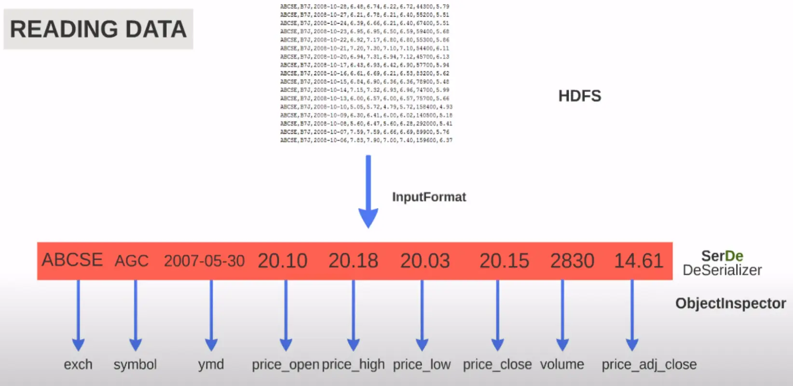

From the last article, [[Introduction to Apache Hive]], we saw how to create a database and a table in Hive.  In this article, we will look at the details behind a Hive table. More importantly, we'll see what are the essential elements that is needed behind the Hive table. We've already created this database `stocks_db` in our last article, so we won't do it again. Thus, we will execute `USE stocks_db;` to switch to the database `stocks_db`. Let's now create a table for the stocks data set.

```sql
CREATE TABLE IF NOT EXISTS stocks (
exch string,
symbol string,
ymd string,
price_open float,
price_high float,
price_low float,
price_close float,
volume int,
price_adj_close float)
ROW FORMAT DELIMITED FIELDS TERMINATED BY ',';
```

The table name is `stocks`, we have listed all the columns in our stocks data set. Our data set is a comma delimited data set, so that is why in the create table instruction we will say `ROW FORMAT DELIMITED FIELDS TERMINATED BY ',';`

The `DESCRIBE FORMATTED stocks;` command will show the detailed information about the stocks table. This information is very useful especially if the table is not created by ourselves but we want to know more information about the table.



First, it is the information about the columns in the table and its data types, which are very similar to Java data types. Next is the information about the database that the table belongs to create a timestamp, etc. Now, let's look at two important attributes of the table, the first one is the location and the second one is the table type. The location attribute specifies the HDFS location from where the table will look up the data set. In fact, when creating a table, we can specify the location attribute if the data set already exists in our Hadoop cluster. So what happens when we don't specify the location attribute? By default, whenever we create a database Hive creates a directory in HDFS and whenever we create a table, by default, Hive creates a directory for the table under the database directory in HDFS. As shown in the above screenshot, with our `stocks_db` database, Hive has created a directory in HDFS named `stocks_db.db` and for the table stocks Hive has created a directory in HDFS named `stocks` under the `stocks_db.db` directory in HDFS. Both these directories are created under `user/hive/warehouse` directory. It is also simply referred to as the Hive Warehouse directory. Next important attribute is the table type. There are two types of tables in Hive: the first type is called MANAGED_TABLE and the second type is called EXTERNAL_TABLE. We're going to look at table types in detail in a separate article. Let's move on to the next set of attributes under `storage information`. These attributes will tell us about the format of the data set and how the data is read and written during Hive execution. When we don't specify a table format when creating a table, Hive will make TextInputFormat to be the default input format and HiveIgnoreKeyTextOutputFormat as the default output format. HiveIgnoreKeyTextOutputFormat is very similar to TextOutputFormat  the only difference is the value of the key is ignored in the output. But what is SerDe? How is SerDe different from the input and output format? SerDe stands for serializer and deserializer. When reading the data, deserializer from SerDe is involved and when writing the data serializer from SerDe is involved.



Let’s assume that we want to find the maximum volume for a stock symbol like GE, for instance, from our stocks table shown in the above diagram. We will write a query `SELECT max(volume) FROM stocks WHERE symbol = ‘GE’`. At runtime, Hive should be able to parse the record, find the column value that corresponds to volume and map the value to the volume column in the table. Hive knows our input is a text file since the input format is TextInputFormat. Thus, the record reader implementation in the input format will return line by line as records from the data set. Once Hive has a record, which is nothing but a line of text, the deserialized method in SerDe deserializes the record as a whole. Now the entire record is deserialized and now we need some help to get the needed data from the record. In our case, we just need the volume column. Mapping the deserialized record into columns is done by a class called object inspector in SerDe. The object inspector knows how to construct individual fields. Again, in our use-case, the object inspector will know how to extract the column value out of a deserialized record.


The exact reverse happens during a write operation, that is, when we’re trying to insert something into a table, serialize method from SerDe will be given a deserialized object representing a record. The serialized method will make use of the object inspector to get the individual fields in the record and convert the record to the appropriate type mapping back to the table. The output format then writes the record into HDFS. That is how SerDe input and output format work together.

Let's go back to the details of the table, the screenshot, SerDe is simply a Java class. When we don't specify a SerDe, the default SerDe is LazySimpleSerDe. We can also write custom SerDe as well. SerDe can be very powerful. Data may have several columns and is represented in JSON format and the data types of each column is not necessarily a simple type like string or float. Meaning most of the columns are complex types like structures arrays and they are nested. In such instance, SerDe helps in two ways: first, to interpret complex and nested data and map it back to our columns in the table and second, to map just the needed columns instead of mapping all the columns from the data set. We'll see that in more detail when we talk about collection types in Hive in another article.

Now we know about SerDe, we've also created a table and know the details and the meaning of important attributes of the table. But what really happens when creating a table, meaning we know where the data for the table is stored in HDFS, but where the metadata for the table is stored? In other words, where is the information in the screenshot stored? The metadata of the table has to be persisted somewhere such that it can be looked up outside of this existing Hive session. When creating a Hive table the metadata of the table is stored in a database like MySQL or Oracle and it is called the metastore. Usually, MySQL is used in production setups. The metastore will only store the metadata information and not the data itself. The data itself will reside in HDFS. But how does Hive know where the database in MySQL resides? And how to connect to it? This information along with several other key properties are stored in the `hive-site.xml` file. The location of the file would vary from cluster to Cluster, for example, `hive-site.xml` can be found under the `/etc/hive/conf` directory.


Here is the contents of `hive-site.xml`, the very first property is the connection URL property will list the URL for MySQL, where the metastore database will be stored. This file also has information about the JDBC driver to be used and other connection properties like username and password to connect to the database. Therefore, now reading this file, Hive knows exactly how to connect to the metastore database, where just the metadata for the hive tables and databases are stored.

Now we know how to create a table and where the metadata for the table resides. Let's finish this article by looking at a few drop commands. We can drop the database with drop database command, i.e. `DROP DATABASE stocks_db` and can drop the table with drop table command, i.e. `DROP TABLE stocks`. However, we can drop a database only when the database is empty. If the database already has tables, we will either have to drop the tables first before attempting to drop the database or do a cascade drop with command `DROP DATABASE  <the database name> CASCADE;`.
