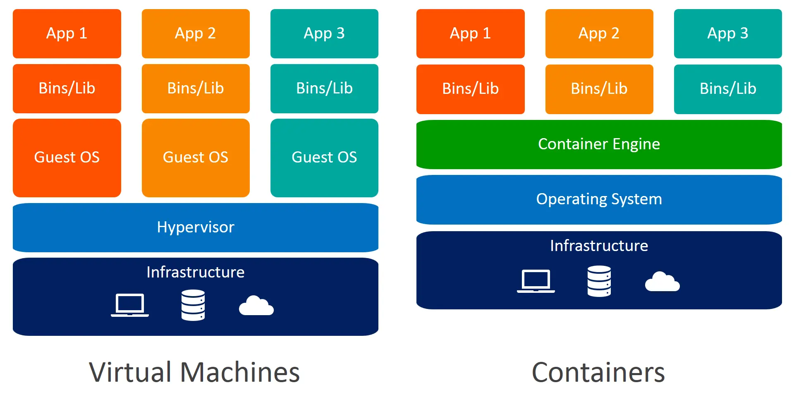

This is the 1st post of Devbox series includes

- [Devbox #1: The world before Docker](https://memo.d.foundation/playground/_memo/devbox-a-world-before-docker)
- [Devbox #2: Our Docker adoption and its challenges](https://memo.d.foundation/playground/_memo/devbox-docker-adoption-and-challenges)
- [Devbox #3: The overview into Nix & how we use Devbox @ Dwarves](https://memo.d.foundation/playground/_memo/devbox-nix-and-our-devbox-adoption)

## The It-works-on-my-machine time

Sometimes, in my software development team, a strange issue is raised. Nobody can evaluate the issue because 'It works on their machine’.One of Docker's most powerful abilities is cross-platform compatibility, which enables seamless deployment across Linux, Windows, and macOS environments. In this way, it broadens adoption and facilitates interoperability in heterogeneous computing environments.

Positively, It is fine because the software actually works somewhere. So you can scope the area of issue and try troubleshooting. But, it is also a red alert on our development process. 

I believe it's not just my problem. Throughout the ongoing evolution of software development, others have likely encountered similar problem. This leads me to wonder, 'Have they implemented strategies to address these issues over time?' 

Right, as software technology develops, we always have ways to improve the output. It encompasses more than just a solution, it represents a rich evolutionary history within the realm of software development.

## First bullet: Virtual machine

During the 1960s, researchers at IBM's Cambridge Scientific Center delved into the development of the first virtual machine operating system. They aimed to address the burgeoning demand for time-sharing capabilities within the computing industry of that era. Despite initial setbacks encountered with the System/360 series, which lacked adequate time-sharing functionalities, persistent efforts eventually led to the creation of CP/CMS as the first virtual machine.

As VM evolved and became more widely known, its benefits for software development processes would have become apparent. Developers and engineers outside of IBM, upon learning about CP/CMS and its virtual machine capabilities, began to explore how similar concepts could be applied to their development workflows.

By the late 1990s, products like VMware Workstation emerged, enabling the running of multiple virtual machines on a single PC. This facilitated software testing across diverse environments.

Not only just for development testing, VM has been widely adopted for creating reproducible development environments that can be shared among team members by taking advantage of its characteristics such as **reproducibility, isolation, portability, and snapshotting.**

However, challenges arise when it comes to sharing the environment among team members. These bottlenecks include ensuring consistent setups, managing resource constraints, handling dependencies, and coordinating collaboration due to the complexity and resource requirements of VMs. Additionally, VM configurations may depend on the underlying hypervisor and guest operating system.

## Containerization, a breath of fresh air!

While everyone is struggling with VM, the modern containerization movement of the early 2010s was kickstarted by Linux Containers, followed by Docker's public unveiling at PyCon in Santa Clara in 2013, with its subsequent open-source release in March of that year. Since then, there has been a significant transformation in the software development process.

Have a lot of things to discuss, but we can distill the variances between VMs and Containers into the following summary

|  | Container | Virtual Machine | Conclusion |
| --- | --- | --- | --- |
| Isolation | Share host kernel, lightweight | Run full OS, heavier | VM is heavier |
| Resource Overhead | Minimal, efficient use of resources | Higher, each VM requires its own OS | VM is heavier |
| Startup Time | Almost instant | Slower due to booting entire OS | VM is heavier |
| Security | Good isolation, but potential risks if host kernel is compromised | Strong isolation between VMs, larger attack surface | VM is heavier |
| Deployment | Highly portable | Flexible but heavier | VM is heavier |

## The opening act with Linux Containers

As I mentioned above, Linux Containers (LXC) was perhaps the first implementation of a complete container manager. It provide a lightweight and efficient approach to deploying and isolating applications

Unlike VM, which require the overhead of running multiple operating system instances, Linux containers share the host operating system's kernel while maintaining separate namespaces for processes, networking, and file systems. This results in faster startup times, lower resource consumption, and greater scalability compared to VMs. 

However, one disadvantage of using Linux Containers directly is the potential lack of comprehensive tooling and ecosystem support, which can lead to integration challenges and a less streamlined development and deployment experience. 

In that situation, Docker was born with more innovations.

## Docker - Innovation of innovation

One of Docker's most powerful abilities is cross-platform compatibility, which enables seamless deployment across Linux, Windows, and macOS environments. In this way, it broadens adoption and facilitates interoperability in heterogeneous computing environments.

Moreover, Docker has a variety system of extensive tooling, and ecosystem that make a big improvement in container management. such as Docker CLI and Docker Hub. These resources streamline every facet of container deployment, from image creation to orchestration, significantly simplifying the development workflow.

Docker's robust ecosystem also garners widespread support from major cloud providers, ensuring effortless integration and scalability in cloud environments. Its user-friendly interface and intuitive workflow further contribute to its appeal, empowering developers to expedite deployment processes without compromising efficiency or reliability.

Consequently, Docker emerges as the quintessential choice for modern containerization needs, offering unparalleled flexibility, convenience, and efficiency to developers and organizations worldwide.

## Final thoughts

In summary, the transition from traditional Virtual Machines (VMs) to containerization, epitomized by Docker, represents a pivotal advancement in software development. Docker's lightweight, portable containers have revolutionized software development and deployment. However, this transformation is not merely about adopting a new technology; it's a journey marked by adaptation and discovery. In the [Devbox #2: Our Docker adoption and its challenges](https://memo.d.foundation/playground/_memo/devbox-docker-adoption-and-challenges), we will uncover the story: how Docker is adopted in my development team and its challenges encountered along the way.
