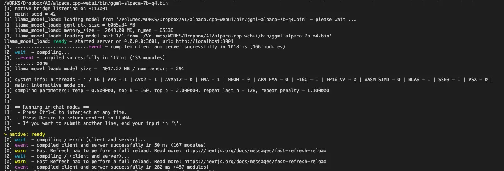

Currently, AI chatbot services like ChatGPT are being widely used, but these services are restricted in many countries and also prohibited by many schools due to the high quality of results they produce compared to the level of students’ knowledge. Additionally, these services also require high costs to generate results. Therefore, I think that if we can run a personal chatbot for use with acceptable results and without hardware costs, you can run it on your personal computer with a minimum requirement of 8GB of RAM. In this post, I will guide you on how to run a personal chatbot with an open model like Alpaca 7b or gpt4all model.

## What is pre-trained models?

The LLM pre-trained model is designed to generate more coherent and contextually relevant text than traditional language models. By using latent variables, the model can better capture the complex relationships between words and phrases in natural language. Additionally, the LLM model is highly customizable, allowing users to specify the structure and complexity of the latent variables to suit their specific needs.

Overall, the LLM pre-trained model is a powerful tool for natural language processing tasks and has been used successfully in a variety of applications, including machine translation, summarization, and dialogue generation, chatbot, virtual assistant.

## Preparing for build AI chatbot:

- Use HuggingFace to download the model: Download the model from HuggingFace.
- Download the chatbot interface source code: requires skill of git, running Node.js, and installing with yarn.
- Update the model and run the chatbot: Update config.

## Install chatbot UI

- Clone chatbot web ui from this repository: [here](https://github.com/ngxson/alpaca.cpp-webui)
- Download chat binding library and open model:

  - Download binding library from:
  - Download open Alapace model 7B from [here](https://huggingface.co/Sosaka/Alpaca-native-4bit-ggml/blob/main/ggml-alpaca-7b-q4.bin)
  - Move binding library and model to folder bin
  - Config model in config.json

    - Example config model alpaca 7B

      

- Install node library and run

  - Run `yarn install` inside repository root folder
  - Start web and waiting load model, Run command: `yarn dev` to start the web. You will see the log after run command: 

- Otherwise, you can use other bigger model to improve the output
  - Using Alpaca 13B model, it require more memory. Download Alpaca 13B from [here](https://huggingface.co/eachadea/ggml-gpt4-x-alpaca-13b-native-4bit/blob/main/gpt4-x-alpaca-13b-native-ggml-q4_0.bin)
  - Using gpt4All model, require another binding library from [here](https://github.com/nomic-ai/gpt4all/tree/main/chat) depending on your OS and download model from [here](https://huggingface.co/4bit/gpt4all-lora-quantized/blob/main/gpt4all-lora-quantized.bin)
  - Using Alpaca 30B model, I had try using model gpt4-x-alpaca-30b-ggml-q4_1 but system cannot load it.
  - Using Alpaca 7B tunning with GPT4
- Test chatbot
  - You can ask chatbot like this 

## Fine-tune your model

To fine tune your model you need create your dataset depend on your data, you can clone our example at [here](https://github.com/thanhpn/df-dataset)

We are using Google colab to train pre-trained model, you can follow the code example at [here](https://colab.research.google.com/drive/1TbV-Enz4O__GFXtqUWEFK0snYedOwPTh?usp=sharing)

## Comparing the chatbot with ChatGPT3

For models with a large number of parameters, such as 30 billion or more, the results generated can be used as a suggestion for further research, but the quality of the answers will not be comparable to ChatGPT3.

## References

- https://huggingface.co/docs/timm/main/en/quickstart#finetune-a-pretrained-model
- https://github.com/EwingYangs/awesome-open-gpt/tree/main
- https://github.com/nomic-ai/gpt4all
