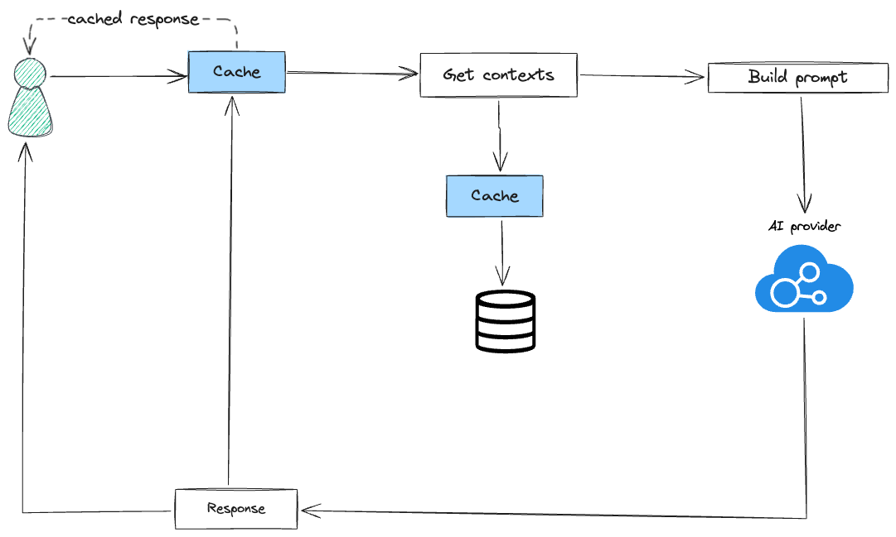
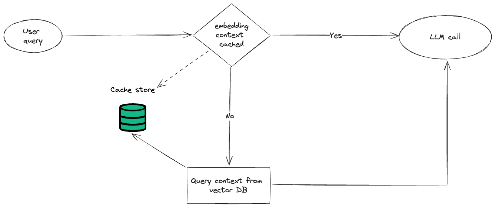
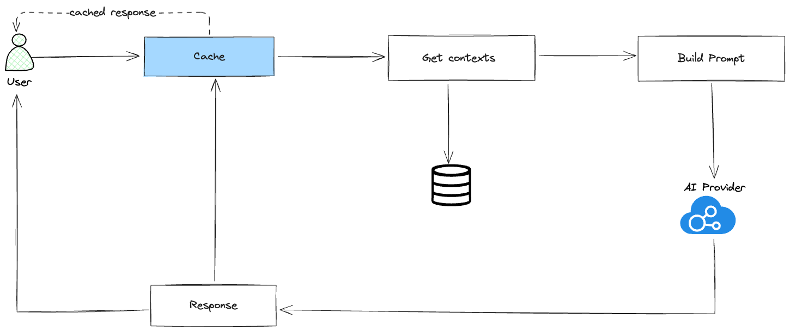

---
tags:
  - llm
  - rag
  - caching
title: Evaluating caching in RAG systems
date: 2024-08-09
description: "Caching is a vital technique that boosts performance by storing frequently accessed information. Let's see how it works with RAG. In this article, we will know how cache could be implement in RAG system."
authors:
  - taynguyen
---

## Introduction

In the rapidly evolving landscape of artificial intelligence, Retrieval-Augmented Generation (RAG) systems have emerged as a powerful paradigm for combining the strengths of retrieval-based and generative models. Caching is a vital technique that boosts performance by storing frequently accessed information. This allows the system to quickly retrieve data without having to repeatedly access large databases, reducing latency and computational costs

## Cache

### KV cache

the KV Cache is a technique used in LLMs to store and reuse intermediate computations (keys and values) to speed up text generation, making the model more efficient, especially when generating longer sequences. In this post, the KV is out of scope. We will focus on the other types of cache.

### Prompt cache

At the level of a large language model (LLM) system, a typical AI workflow often involves repeatedly passing the same input tokens to the model. Without a prompt cache, the model must process the system prompt for each query, leading to redundant computations. However, with a prompt cache, the model processes the system prompt only once for the initial query, improving efficiency by eliminating repetitive processing.

For applications with long system prompts, a prompt cache can significantly reduce both latency and cost. It is also beneficial for queries involving long documents. For instance, if many user queries pertain to the same extensive document, like a book or codebase, caching this document allows for efficient reuse across multiple queries.

Example of prompt cache implementation:

- Gemini context caching: https://ai.google.dev/gemini-api/docs/caching
- LLAMA: https://github.com/ggerganov/llama.cpp/blob/master/examples/main/README.md#prompt-caching

This caching technique is typically implemented by inference APIs that we use. We could consider this when select the ai provider / inference API for our RAG system.

### Exact cache

If prompt cache and KV cache are unique to foundation models, exact cache is more general and straightforward. Your system stores processed items for reuse later when the exact items are requested. For example, if a user asks a model to summarize a product, the system checks the cache to see if a summary of this product is cached. If yes, fetch this summary. If not, summarize the product and cache the summary.

Exact cache is also used for embedding-based retrieval to avoid redundant vector search. If an incoming query is already in the vector search cache, fetch the cached search result. If not, perform a vector search for this query and cache the result.

### Semantic cache

A semantic caching system aims to identify similar or identical user requests. When a matching request is found, the system retrieves the corresponding information from the cache, reducing the need to fetch it from the original source.

For instance, queries like **What is the capital of Vietnam?**, and **What the capital of Vietnam is?** all convey the same intent and should be identified as the same question.

There are 2 place we could implement semantic cache:

- Between the user and the vector database: This would help us keep the advantage of generative model, the answer is different every time with the same context.
- Between the user and the generative model: This would make the answer to be the same every time with the same context. This is useful when we want to keep the answer consistent and reduce the cost of generating the same answer multiple times.

Placing it at the model’s response point may lead to a loss of influence over the obtained response. Our cache system could consider **"Explain the French Revolution in 10 words"** and **"Explain the French Revolution in a hundred words"** as the same query. If our cache system stores model responses, users might think that their instructions are not being followed accurately.

Based on the use case, we could choose the right place to implement the semantic cache. But most of the time, we will choose the first option to keep the advantage of generative model.



## Semantic cache implementation

### Cache between user and vector database

We would need some tools/libraries for this:

- Embedding tool: to transform the sentences into fixed-length vectors, also know as embeddings. Like: [sentence transformers](https://github.com/UKPLab/sentence-transformers) or could use api of openai if you have budget/access to it.
- Vector database: to store the embeddings. Like: [chromadb](https://github.com/chroma-core/chroma), [pgvector](https://github.com/pgvector/pgvector).



To be able to determine the similarity between the user query and the cached queries, we need to store user query embeddings in the vector database. When a user query comes in, we transform it into an embedding and search for the most similar embeddings in the vector database. If the similarity score is above a certain threshold, we consider the user query to be the same as the cached query and return the cached response.

Example of transforming the user query into embeddings using openai api:

```typescript
type EmbeddingData = {
  object: string
  index: number
  embedding: number[]
}
let data: EmbeddingData[] = []

const response = await fetch('https://api.openai.com/v1/embeddings', {
  method: 'POST',
  body: JSON.stringify({
    input: contents,
    model: 'text-embedding-3-small',
    dimensions: 1024,
  }),
  headers: {
    'Content-type': 'application/json',
    Authorization: 'Bearer ' + openAICred,
  },
})

type JSONResponse = {
  data?: EmbeddingData[]
}
const resBody = (await response.json()) as JSONResponse
const data = resBody?.data ?? []
```

After that we stored the embeddings in the vector database. This is example code using drizzle-orm with postgresql (with pgvector extension):

```typescript
// Schema definition in schema.ts
const semanticCache = createTable(
  'semantic_cache',
  {
    id: uuid('id').notNull().primaryKey(),
    typeId: integer('type_id'),
    key: text('key').notNull(),
    value: jsonb('value'),
    vector: vector('vector', { dimensions: 1024 }),
    createdAt: timestamp('created_at').notNull().defaultNow(),
    expiredAt: timestamp('expired_at'),
  },
  (self) => ({
    vectorHnswIndex: sql`CREATE INDEX kv_cache_vector_hnsw_idx ON kv_cache USING hnsw (vector vector_cosine_ops) WITH (m = 16, ef_construction = 64)`,
  }),

  // Example store the embeddings
  await db.insert(schema.semanticCache).values({
    id: uuidv7(),
    typeId: input.type,
    key: input.key,
    value: JSON.stringify(input.value),
    vector: rs?.embeddings,
    expiredAt: dayjs().add(input.durationSecs, 'seconds').toDate(),
  }),
)
```

How we search for the similar embeddings in the vector database:

```typescript
const rows = await db
  .select({
    contexts: schema.semanticCache.value,
    similarity: sql<number>`1 - (${schema.semanticCache.vector} <=> ${sql.raw(`'[${msgEmbeddings.join(',')}]'::vector`)})`,
  })
  .from(schema.semanticCache)
  .where(and(eq(schema.semanticCache.typeId, CacheTypeEnum.UserQueryEmbedding), gt(schema.semanticCache.expiredAt, new Date()), sql<boolean>`(1 - (${schema.semanticCache.vector} <=> ${sql.raw(`'[${msgEmbeddings.join(',')}]'::vector`)})) > ${CACHE_EMBEDDING_SIMILARITY_THRESHOLD}`))
```

After that, we could return the cached response if the similarity score is above a certain threshold.

### Cache between user and generative model



This is similar to the previous implementation, the difference is that instead caching the embeddings, we cache the response of the generative model. As mentioned above, this is useful when we want to keep the answer consistent and reduce the cost of generating the same answer multiple times. But it reduces the flexibility of the generative model.

## Conclusion

Caching is a vital technique that boosts performance by storing frequently accessed information. This allows the system to quickly retrieve data without having to repeatedly access large databases, reducing latency and computational costs. In RAG systems, caching can be implemented at various levels, including KV cache, prompt cache, exact cache, and semantic cache. The choice of cache type depends on the use case and the desired trade-offs between performance, cost, and flexibility.

## Reference

- https://huyenchip.com/2024/07/25/genai-platform.html#step_4_reduce_latency_with_cache
- https://arxiv.org/pdf/2311.04934
- https://github.com/UKPLab/sentence-transformers
- https://huggingface.co/learn/cookbook/en/semantic_cache_chroma_vector_database
