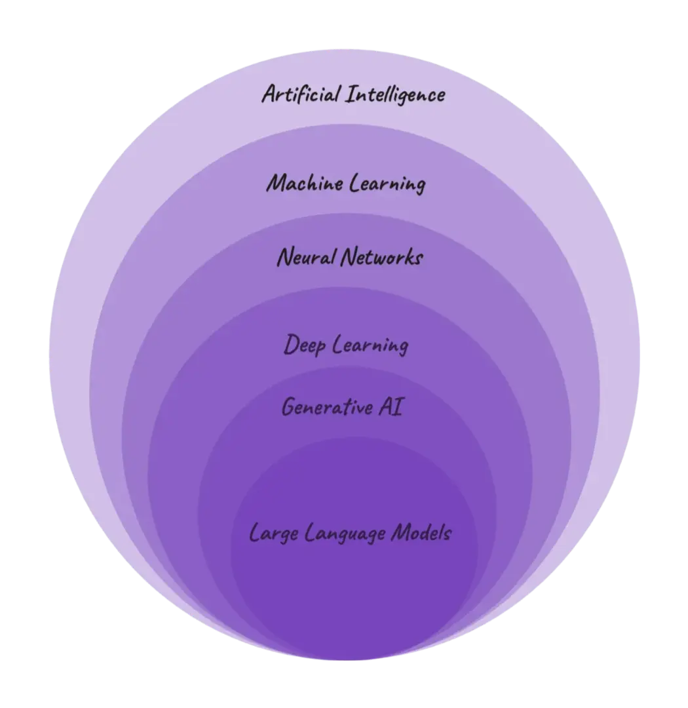
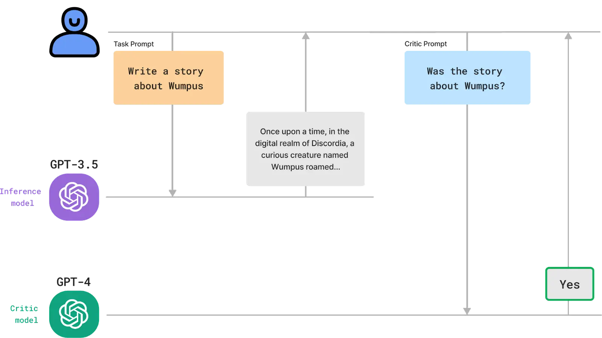

---
authors:
  - "antran"
date: "2024-05-02"
description: "Generative AI overview and the different stages of building an LLM-powered feature"
hashnode_meta:
  id: "670f4d514d1924a802ea893b"
  slug: "developing-rapidly-with-generative-ai"
sync: "hashnode"
tags:
  - "llm"
  - "ai"
  - "tooling"
title: "Developing rapidly with Generative AI"
---
## Generative AI

Generative AI is a subset of artificial intelligence that focuses on creating new content, such as images, text, or audio, based on patterns learned from existing data.

## Stages for Building LLM-powered Features

### 1. Identify use cases

The first stage is to identifying where generative AI can make an impact. The common challenges can be:

- Involve analysis, interpretation, or review of unstructured content (e.g. text) at scale
- Require massive scaling that may be otherwise prohibitive due to limited resources
- Would be challenging for rules-based or traditional ML approaches

### 2. Define requirements

This phase requires a thoughtful analysis to select the best-suited LLM and to frame the problem as a prompt to an LLM. Several factors of defining product requirements:

- **Latency**: How fast does the system need to respond to user input?
- **Task Complexity**: What level of understanding is required from the LLM? Is the input context and prompt super domain-specific?
- **Prompt Length**: How much context needs to be provided for the LLM to do its task?
- **Safety**: How important is it to sanitize user input or prevent the generation of harmful content and prompt hacking?
- **Language Support**: Which languages does the application need to support?
- **Estimated QPS**: What throughput does our system eventually need to handle?

### 3. Prototype

Selecting off-the-shelf LLM which use for the prototype. The general idea is that if problems can't be adequately solved with state-of-the-art foundational models like GPT-4, then more often than not, those problems may not be addressable using current generative AI tech.

The key step at this stage is to create the right prompt. To do this, a technique known as [AI-assisted evaluation](https://arize.com/blog-course/llm-evaluation-the-definitive-guide/) can help to pick the prompts that lead to better quality outputs by using metrics for measuring performance.

### 4. Deploying at Scale

 This involves setting up the infrastructure to handle the expected load, monitoring the system's performance, and ensuring that the feature continues to meet the requirements set in the previous stages. There are 2 ways to consider for deploying:

- **Using commercial LLMs**: this is greate to accessing to top-notch models, don't have to worry about setting up the tech, but the expenses can add up quickly.

- **Self-hosted LLMs**: can reduce costs dramatically - but with additional development time, maintenance overhead, and possible performance implications.

## References

- [Developing rapidly with Generative AI](https://discord.com/blog/developing-rapidly-with-generative-ai)
- [Artificial Intelligence, Machine Learning , Deep Learning, GenAI and more](https://medium.com/womenintechnology/ai-c3412c5aa0ac)
- [LLM Evaluation: Everything You Need To Run, Benchmark LLM Evals](https://arize.com/blog-course/llm-evaluation-the-definitive-guide/)