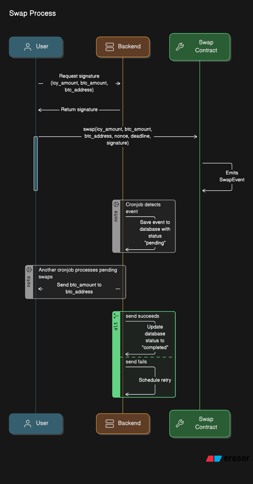

---
tags:
  - icy
  - btc
  - swap
  - blockchain
title: Implement a Token Swap from the base chain to Bitcoin for cross-chain transactions
date: 2025-03-07
description: This guide shows how to implement a token swap from the Base Chain to Bitcoin.
authors:
  - quang
toc: false
notice:
event_date:
---

Swapping ICY tokens for Bitcoin means exchanging one type of digital currency for another across different blockchain systems. Since ICY tokens (on the Base chain) and Bitcoin (on its own blockchain) operate on incompatible networks, specific tools are needed to make this process work. Below, I’ll explain the tools, why a direct swap isn’t possible, how the swap happens, and how the price is determined.

## Tools Used in the Swap
Swap Contracts: Automated programs on the Base chain that securely manage the swap process.
Treasury Wallets: Digital wallets that hold ICY tokens and Bitcoin during the exchange.
Icy-Backend: A system that receives your swap request, tracks it, and triggers the Bitcoin transfer.

## Why It’s Not a Direct Swap
A direct swap isn’t possible because ICY tokens and Bitcoin use different blockchains. The Base chain is a modern system with advanced features, while Bitcoin’s blockchain is older and more limited. These differences prevent direct transfers, so tools like swap contracts and oracles are used to bridge the gap.

## How the Swap Works
Swapping ICY tokens for Bitcoin is a straightforward process that combines user actions, system automation, and secure on-chain technology. Here’s how it works in a concise, step-by-step breakdown:

**Initiate the Swap**

You start by clicking "Swap" on the website. Enter the amount of ICY you want to trade and your Bitcoin address. The system saves your request by listen emitted events on the swap contract in a database to ensure it’s tracked.

**ICY Tokens Are Burned**

The Swap Contract processes your request, permanently removing (or "burning") your ICY tokens from circulation. It then signals that the swap is underway.

**Bitcoin Is Delivered**

The backend regularly checks events on the Swap Contract to detect your swap request, use request's information such as BTC amount, BTC address, and sends it to your address from the treasury wallet. If any issues arise, the system automatically retries using cronjobs to ensure delivery.

## How the Price Is Set
An oracle determines the swap price by evaluating:

**Circulating Supply of ICY**: The total number of ICY tokens still available. As more tokens are burned, this supply shrinks, which may influence the price.

**Available Bitcoin**: The amount of Bitcoin in the treasury wallet ready for swaps.

The oracle uses this information to calculate a fair amount of Bitcoin for your ICY tokens.

### Adjusting for Bitcoin Price Changes
When Bitcoin’s market price drops, the system adjusts to keep the swap fair. Additional Bitcoin is deposited into the treasury wallet, updating the internal swap price. This ensures you receive the right amount of Bitcoin, even if its value decreases.

## Conclusion
This process uses specialized tools and steps to securely swap ICY tokens for Bitcoin, overcoming the challenges of their different blockchain systems while maintaining fairness in pricing.