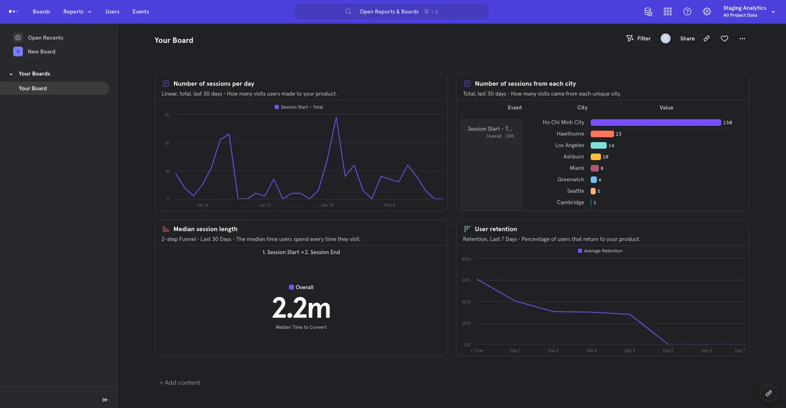

Mixpanel is a powerful analytics platform that assists companies in monitoring and analyzing user behavior on their websites and mobile applications. With Mixpanel, you can analyze user activity, evaluate the performance of your products, and improve user experience through data-driven decisions.


## Key features
Some key features of Mixpanel include:

1. **Real-time analytics**: Mixpanel offers data on user activity in real-time, enabling organizations to instantly see patterns and take wise decisions.
2. **Custom Event Tracking**: Businesses can better understand how customers engage with their products by tracking custom events like button clicks, form submissions, and in-app payments using Mixpanel.
3. **Funnels and Retention**: Mixpanel offers robust tools for funnel analysis to assist companies better understand how customers interact with their products and how to increase user retention.
4. **People Analytics**: Mixpanel allows businesses to segment and understand their user base by tracking user behavior, demographics, and other key metrics.
5. **Mobile Analytics**: Mixpanel offers robust mobile **analytics** **that** enable businesses to track user behavior on both iOS and Android platforms.
6. **Segmentation**: Mixpanel enables businesses to create custom segments of users, based on specific behaviors or attributes, to understand how different groups of users engage with their products.
7. **Integration**: Mixpanel integrates with a wide range of tools, including popular CRM and marketing automation platforms, making it easy to use alongside other technologies.

## Integration with React
1. Create a Mixpanel account and get a Mixpanel project token. To use Mixpanel, you need to sign up for an account and create a project. When you create a project, you receive a unique token that is used to identify your project.
2. Install the Mixpanel library: You can install the Mixpanel library by running the following command in your terminal:

```zsh
yarn add mixpanel-browser
```

3. Import the Mixpanel library into your React component: In your React component, import the Mixpanel library as follows:

```ts
import mixpanel from 'mixpanel-browser';
```

4. Initialize Mixpanel: In your component's constructor or useEffect hook, initialize Mixpanel with your project token:

```ts
//index.tsx
mixpanel.init("YOUR_MIXPANEL_PROJECT_TOKEN");
```

5. Track events: To track events in your React application, you can use the Mixpanel `track` method. For example:

```ts
mixpanel.track("Button clicked");
```

6. Use Mixpanel's identify method to track unique users: The Mixpanel `identify` method allows you to track unique users in your application. You can call this method with a unique identifier for the user, such as an email address or user ID:

```ts
mixpanel.identify("user_id");
```

7. Additionally you could use people.set.method to create a profile for the users

```ts
mixpanel.people.set({
 $name: profile?.fullName,
 $email: profile?.email,
 $company_name: profile?.company?.name,
 $company_id: profile?.company?.id,
 $user_id: profile?.id,
});
```

As you can see in the images bellow all users interact with the app will be listed.


You can observe all the events created by the users.


## References
- <https://developer.mixpanel.com/docs>
- <https://www.npmjs.com/package/mixpanel-browser>
