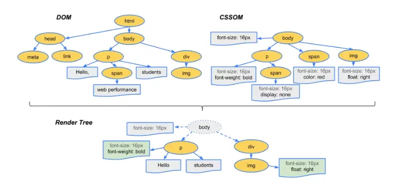

The key to improving your website speed is to understand where the bottlenecks are, and how much time each step takes. When we talk about web performance basically we talk about either the two aspects: network latency and browser rendering.

## Network latency
Network latency is related to how long it takes for a request to be sent from your computer to the server and back again, and then rendered by the browser. It is affected by many factors, including your ISP speed, DNS lookup, TCP handshakes, the number of hops between you and the server, request processing time on the server and so on. If your website uses a lot of static assets (images, videos, etc), it will take longer for all of these requests to be sent over the network, which can negatively impact page load times.

There are numerous ways to improve network latency but following are the key points:

- Locate the server close to the client
- Reduce server response time (logic optimization, setup cache layer,...)
- Make file size smaller by using techniques such as code splitting or compressor
- Preload resources using resource hint
- Use a CDN

## Browser rendering
Browser rendering is how long it takes for your browser to display your page after receiving all of its data. The process contains a series of steps that the browser performs on a web page to display on the screen. Each of these individual steps is complex and has been optimized over time by browser vendors.

There are many different browsers out there, but they all perform the same basic set of steps when rendering a webpage. These steps can be broken down into 2 parts:

- Parsing static assets (HTML, CSS, JS)
- Running pixels-to-screen pipeline

Parsing is a static process that doesn't depend on the state of the application. The browser needs to read your HTML and CSS and map them into an internal tree structure. This tree is then used to render the page on screen. This phase is usually very fast, but it does take time - especially if you have a lot of HTML, CSS and JavaScript in your page. The steps in this phase includes:

- Construct Document Object Model (DOM) based on the HTML
- Construct Cascading Style Sheet Object Model (CSSOM) based on the CSS
- Combine DOM and CSSOM to generate the render tree. It has all the style properties for every node of the DOM that is needed to be rendered.

In addition to parsing, browsers also run pixel pipelines on each frame. Pixel pipelines are basically a bunch of algorithms that take information from the DOM and apply it onto the screen. For example: painting backgrounds (CSS), applying effects (SVG filters) or animating things (CSS transitions). These algorithms are executed every single time there's a change in state (e.g. scroll position changes), causing them to be executed many times per second - even if nothing has changed. There are five major areas that you need to know about and be mindful of when you work

- **JavaScript**: JavaScript execution normally is used to modify the DOM. For example, you can add event listeners or create new elements.
- **Style calculations**: The browser determines which CSS rules apply to which elements.
- **Layout**: The browser figures out where each element should be positioned on the screen (which includes things like width, height and position).
- **Paint**: Once the layout has been calculated, the browser paints every visible element on the screen.
- **Compositing**: Once all elements have been painted, they are combined together into one image that contains everything that will be displayed onscreen at once — known as a frame.

The goal of delivering a fast, smooth transition web application is **to do less work** during the rendering process. You need to understand how HTML, JavaScript and CSS are handled by browsers as each phase occurs. Then ensure that the code you write (and the other 3rd party code you include) runs as efficiently as possible. For example, to reduce the amount of time it takes for style calculations to be completed, understand [CSS specificity](https://web.dev/learn/css/specificity/) so you can write simple class names and reduce the number of styles that affect a given element.

## Reference
- [Katie Sylor Miller :: Happy Browser, Happy User!](https://www.youtube.com/watch?v=VAKD_Ob0XTQ&t=568s&ab_channel=estellevw)
- https://web.dev/rendering-performance/
- https://codeburst.io/painting-and-rendering-optimization-techniques-in-browser-2e53a70e7ee
- https://web.dev/critical-rendering-path-render-tree-construction/
