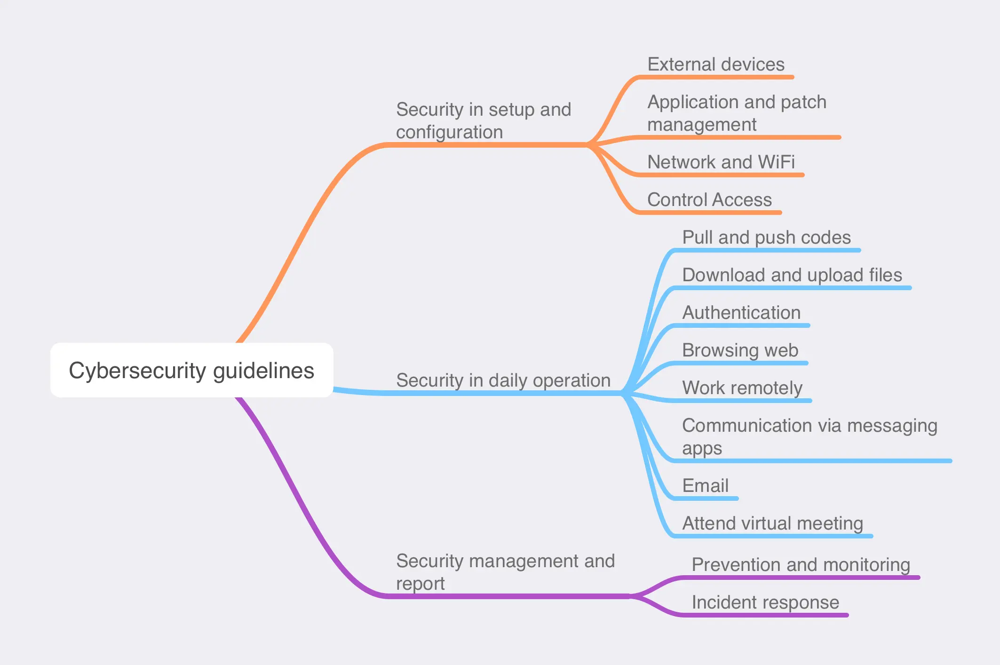
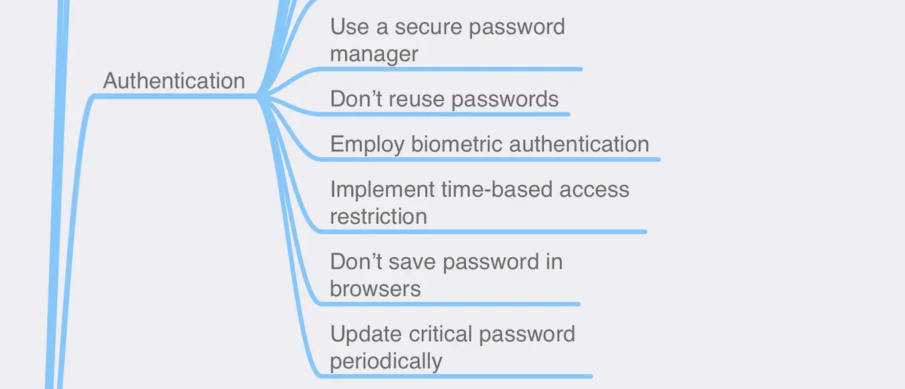

---
tags:
  - security
  - standardization
  - work-adoption
title: How I came up with our Security Standard
date: 2024-04-19
description: "In this memo, I want to share with you my thought process behind our security guideline for Dwarves. This is a critical aspect for a software company that aims to establish trusted partnerships with clients. They rely on us because we take the security of their ideas and data seriously."
authors:
  - thanh
menu: playground
type: playground
hide_frontmatter: false
pinned: true
hide_title: false
---
In this memo, I want to share with you my thought process behind our security guideline for Dwarves. This is a critical aspect for a software company that aims to establish trusted partnerships with clients. They rely on us because we take the security of their ideas and data seriously.

## Background

Several factors prompted us to develop a set of security guidelines:

**Client Request**: We are partnering with a corporation that requested us to adhere to specific security measures to prevent data leaks, even though our development staff had already signed NDAs.

**Low Security Awareness**: There is a noticeable lack of security awareness among our team. Some team members discuss or share sensitive information in public channels, or work in remote areas without adequate computer security. This could stem from a lack of personal awareness or insufficient training.

**Capability Enhancement**: Enhancing our security capabilities will make us stronger and more confident when dealing with larger clients in the future.

## Key Considerations

Here are some crucial points that influenced how we crafted the guideline:

**Compliance with Major Standards**: The security requirements from clients often overlap with common standards like ISO 27001 or GDPR. Our guideline incorporates key points from these standards to avoid constant updates or changes when starting with new clients.

**Remote Work Adoption**: The guidelines must align with our remote work culture. We can't rely on physical security measures like isolated networks or locked rooms. Instead, we face challenges like unsecured networks and unauthorized access to computers.

**Focus on Daily Development Activities**: Our guideline reminds developers that their routine activities—such as coding, browsing the web, or taking breaks—can pose security risks. It aims to heighten awareness of potential security breaches and how to prevent them.

**Accessibility**: Many existing security guidelines are verbose and difficult to digest. Ours is designed to be straightforward, making it easier for our team to learn and implement in training.

## Initial Structure

The security guideline is divided into three main sections:

1. **Security in Setup and Configuration**: This section covers secure configurations and setups for network connections and access control.
2. **Security in Daily Operation**: Here, we address security issues that can arise during daily tasks.
3. **Security Management and Reporting**: This section outlines the policies, processes, and tools we've implemented to monitor security breaches and receive alerts.

Each section includes various topics, and each topic lists practical dos and don'ts, explaining why certain practices should or should not be followed, supported by visual illustrations.

## Conclusion

Once implemented and integrated into our practice and training, these guidelines will help our team stay secure and compliant. This will not only enhance our reputation as a brilliant software company but also demonstrate our responsibility and professionalism by safeguarding our clients' ideas and assets with utmost security.