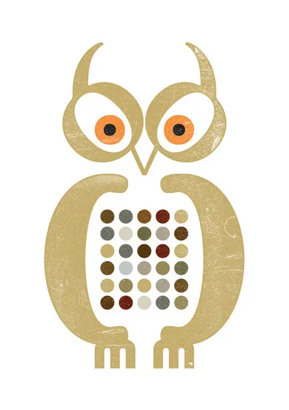
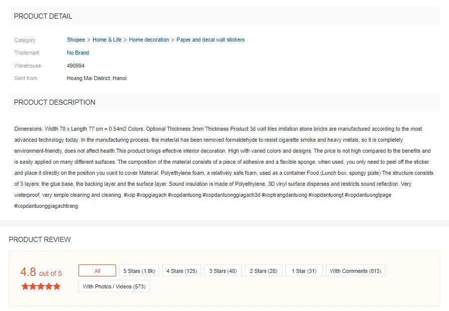
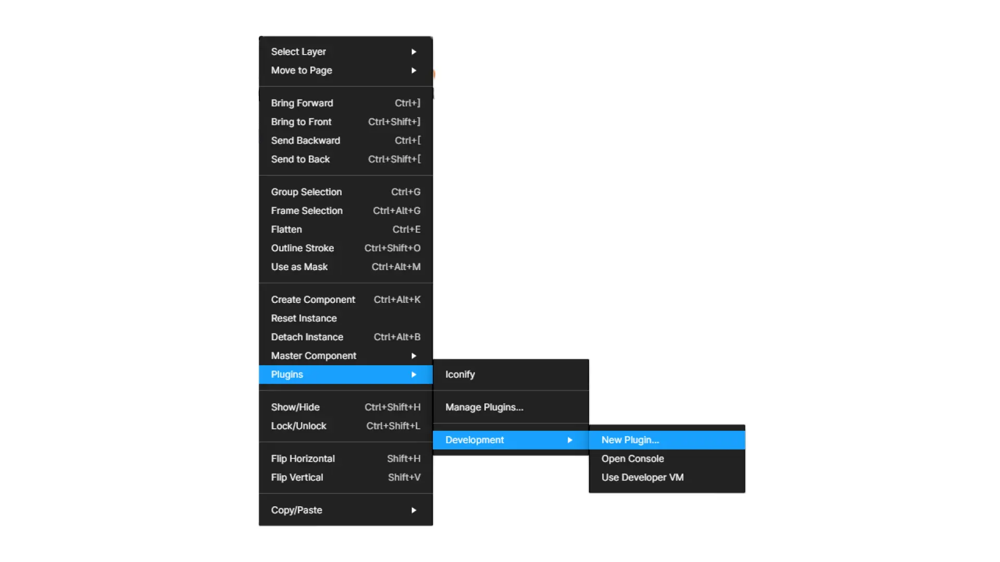
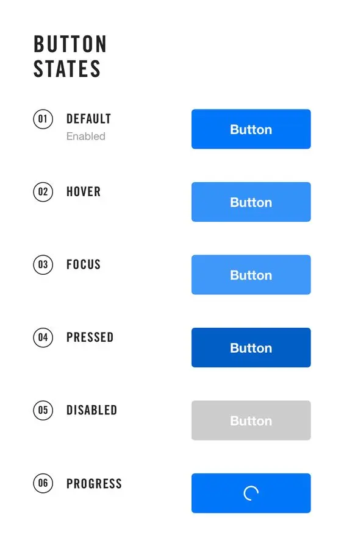
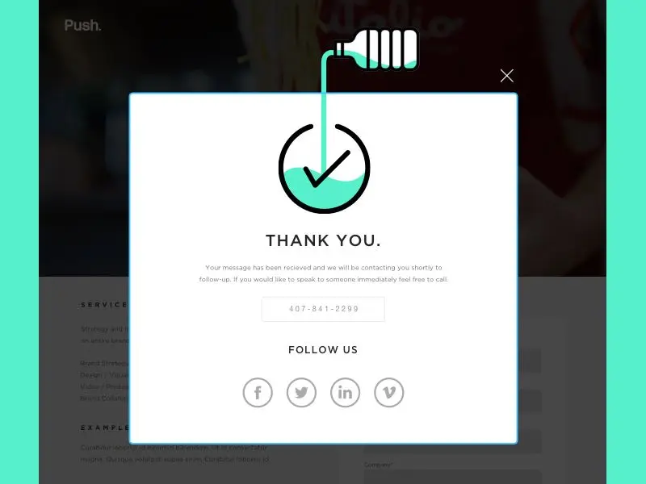

Take a second to look at the image above. How do you feel? Do you see that it is similar to an owl face? The answer to this phenomenon is called Isomorphism which is part of the 12 Gestalt rules. Just like Isomorphism, you will sometimes feel that a cloud is similar to a horse or a branding logo which is created by different shapes that can finally turn out to be a meaning object. Those logos embrace the brand mission, character, and business. So what are Gestalt Rules and how we can apply it to our UI Design? Let’s dive into it.

## Introduction to Gestalt rules**
Gestalt is a word that is generated from Germany which means shape or form. Gestalt principles explain how humans perceive the outside world, how they recognize the pattern, and simplify complex images in daily life. In the User Interface Design field, we use Gestalt rules to make the design look more aesthetic and friendlier to users. In this article, we will discuss the 6 principles that are mostly used in every UI design.

## Proximity
Elements that are closer to each other are considered to be more related. The Principle of Proximity explains that people perceive elements in the way that they are grouped according to the distance.

**Applying the Proximity Principle in UI Design**
If you are new to UI Design, there would be sometimes you are quite confused about how to arrange elements like heading, the subtitles, body text, or pictures… in a harmonious way so that it looks good and easy for users to find information. The Proximity principle will be a great guide for you to follow. For example, in an e-commerce product card, all the product detail content should be placed nearer to each other so that they become a group. So do the product description and the product review. Finally, we got 3 obvious different pieces of information: product detail, product description, and product review, which are ready to be scanned and digested.

The Proximity Principle is presented by white space to optimize and show the relationship, the visual hierarchy between components. Similar information and content are arranged near to each other so that it is perceived as a group. This way of organization creates good visual communication with users, helps them scan layout, read, and digest information quickly. Good applying of white space can enhance the interface appearance, support users to achieve goals faster as well as improve their user experiences.

## Common Fate
Elements that go in the same direction as part of a stimulus is considered to be in a group. For example, when you see a flock of birds or a shoal of fish you will automatically feel that they are related to each other or belong to a group.

**Applying Common Fate Principle in UI Design**
The fact that the movement direction of elements shapes our perception of grouping creates the foundation for drop-down menu design. Let’s right click your mouse and see every sub-option of each category all appear on the right side of the main menu tab. This right orientation together with the highlight color effectively support users in their process of making choice.

## Similarity
Similar elements are usually considered to be in a group. If you are given 10 candies with 3 of them are red and the others are green. How would you group them? Most of us will have the answer that 3 red candies are in the same group and the other group will have 7 green candies. As a normal reaction humans tend to organize objects that have the same character or attribute to the same group.

**Applying Similarity Principle in UI Design**
Similarity Principle is the answer to why the button system of every application is required to be unified. If you are familiar with an application, the time you take to finish a goal is only just a couple of seconds. The synchronization of the button appearance as well as the color throughout the application helps reinforce the smoothness of the user experience.

Let’s imagine you are using an application, its button system changes in terms of color and style at every single stage to show the aesthetic skill of the UI designer. Think about it, if it is a money transfer application which requires high accuracy at each step. However, you have to stop to observe, think, and predict which button should you choose so that you won’t make any serious mistake that causes you to lose an enormous fortune. Feel the pressure and you will understand why there is a united button system in UI design.

In website or application design the style, the color, as well as the character of the button are advised to be united so that users won’t get confused or take much effort to make a choice when interacting with your application or website.

## Closure
Our eyes will automatically fill in the missing parts between different shapes and turn them into a unified and meaningful whole. This principle is mainly used in designing icons and logos. The logo below is a well-explained example of the Closure Principle. The arrangement of those black shapes together with the white space successfully turned the unfinished panda image into a stunning and famous logo.

**Applying the Closure Principle in UI Design**
The presence of the Closure Principle in UI design is shown through the iconography. Humans tend to recognize an image much faster than a line of text and the narrow space of mobile devices also contributes to the usage of icons. Therefore, icons are widely used in designing applications and websites especially applications where we need to communicate sharply and accurately in other to achieve our main goal. However, a label under the icon could be a great choice for those who are new to your product.

## Continuation
The Continuation Principle explains that objects which are aligned with a straight or curved line usually are perceived to be related or in the same group. Take a look at the picture below, you can see that green dots which are on the right seem to be related than those on the left.

**Applying the Continuation Principle in UI Design**
The continuation principle is best described in the UI field by the alignment of elements. If you have used an application to purchase things online you will see that all the content of a product card will be aligned to the left except for the call to action button. This organization draws our attention to the button which helps users quickly identify the important information, encourage the next step to happen, and reduces the frustration for users when there is a lot of information on one screen.

## Figure/ Ground
The Figure/Ground Principle demonstrates the human ability to visually separate the object from the background to place the focal point on the important element. This helps decrease our brain tension when it has to process too much information at the same time.

**Applying the Figure/ Ground Principle in UI Design**
There are a lot of ways to create the Figure/ Ground effect, for example, semi-transparent overlay, shadow, or blurring the background.

## Conclusion
User Interface isn't only about aesthetics. It's also about usability, performance, and how users experience the product along the way.

Gestalt Principles will be an active supporter for us during our UI design process. Before we fully understand UI's beauty and how to create it, those principles are our guidance.

However, never limit yourself to any line or principles. Rules are subjected to be broken. Feel free to stay creative. A great UI design is a harmonious combination of accessibility, feasibility, and art.
