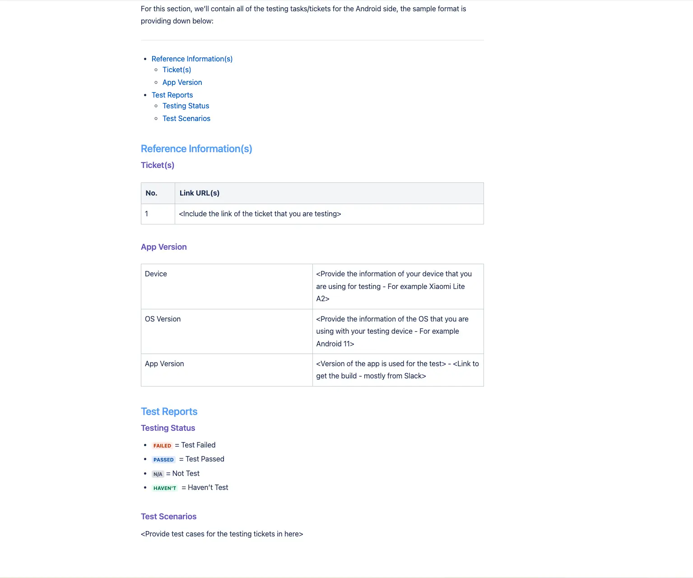
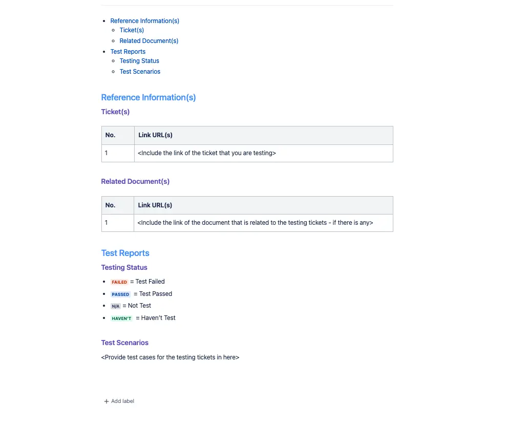
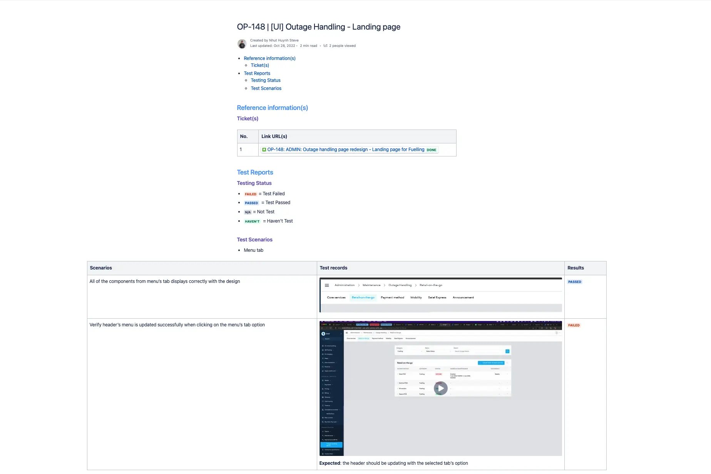

*The following entry is from the thoughts, compositions, and conclusions from field work by one of our leads.*

From one development team, we have quite a lot of different roles like: BackEnd engineers, FrontEnd engineers, Mobile engineers (include Android and iOS), Quality Assurance engineers, etc. For the developer's side, they can keep track on their works based on the Merge Request that they have been created, and also they have something to filter for their searching better when they want to take a look for the things they have already developed.

On the other hands, from the QA's side, every time they finished on their test, they just made a comment for the record on the ticket only. At this point, I can see that when they want to find the testing record again, they will found a little bit struggle to filter it from the Jira's site.

At this point, I will share a way that my team is using to record their testing and managing their test as well.

## Testing Documentation
Usually, when a developer finish their ticket for the feature enhancement from Dev environment, they will require an assistant from the QA members to take a look at it before releasing it into other environments like: Staging, Production. At this point, QA members are going to test on that. But instead of comment directly into the ticket that they are testing, they will need to prepare a testing documentation instead, here are the items that will be put into the doc:

- **For Mobile testing document format:**
  - Reference information(s)
    - Ticket(s): we will include the ticket that the team is working with on the development and testing.
    - App version: we will provide the information of the device that we are using for the testing for the ticket in here.
  - Test report(s)
    - Testing status - there are 4 common statues: Failed, Passed, N/A, and Haven't.
    - Test scenario(s): provide test cases for the ticket.

- **For BackEnd/FrontEnd testing:**
  - Reference information(s)
    - Ticket(s): we will include the ticket that the team is working with on the development and testing.
    - Related document(s): we will include the related document to the ticket from this section.
  - Test report(s)
    - Testing status - there are 4 common statues: Failed, Passed, N/A, and Haven't.
    - Test scenario(s): provide test cases for the ticket.

