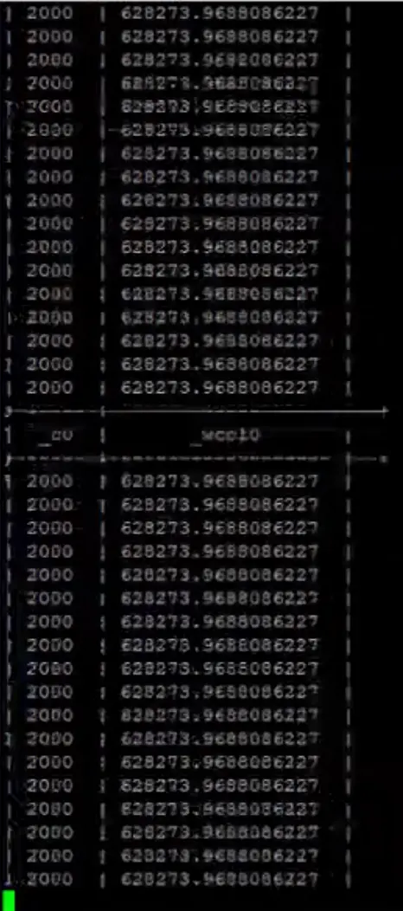
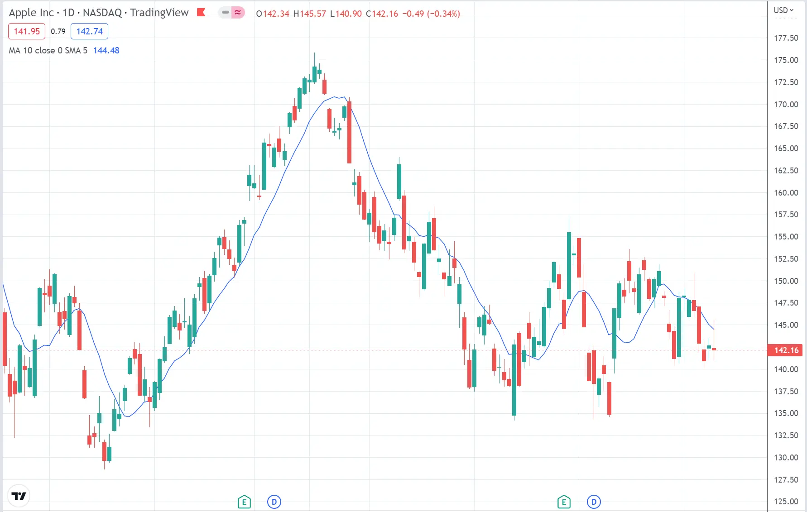
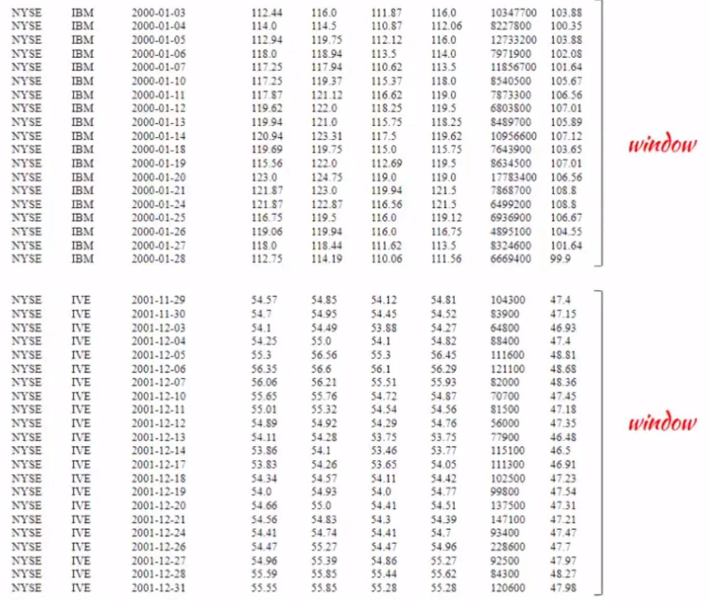
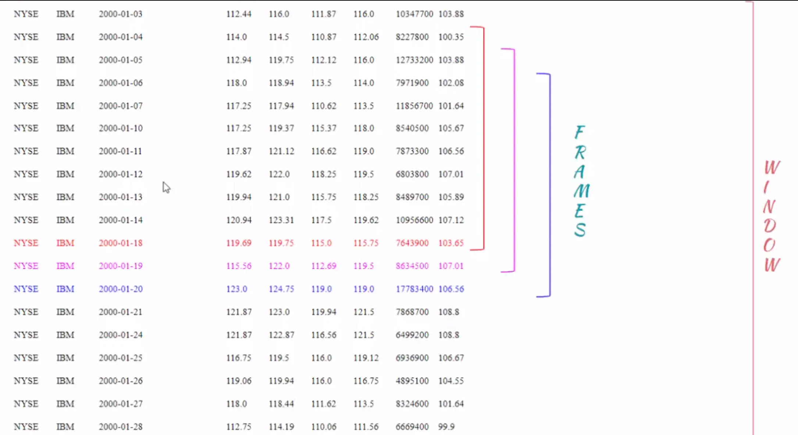

If you're a SQL or PL/SQL developer or developed an ETL process before, you know just plain SQL is not going to get the job done. To implement complex use cases, we need powerful window and analytical functions. The good news is Hive supports both window and analytical functions. Before we look at an example of window and analytical functions, let's understand what they are and why do we need them. Let's take our very old stocks data set and say we want to calculate average volume by stocks by year. We've done this before already on some previous articles about Apache Hive. And the following query show it looks like in Hive.

```sql
SELECT
  year(ymd),
  avg(volume)
FROM stocks
WHERE year(ymd) in ('2000', '2001')
GROUP BY year(ymd);
```


We do a select on the year followed by the average aggregate function on volume and then we say `GROUP BY year(ymd)`. To limit the execution, we limit the records to years 2000 and 2001. The result has two records, one record for each year and the average volume by each year. First, the records were grouped by the columns mentioned in the group by clause and then the aggregate function is applied on each group. The important thing to note is that the result is collapsed, we see one record at the end for each group. In our case, we get one record per year. Let's see how do we do this with analytical functions with the following query:

```sql
SELECT
  year(ymd),
  avg(volume) OVER(
    PARTITION BY year(ymd)
  )
FROM stocks
WHERE year(ymd) in ('2000', '2001');
```



In the query, we don't have `GROUP BY` clause instead we have `avg(volume)` followed by over `OVER(PARTITION BY year(ymd))`. `PARTITION BY` works similar to `GROUP BY`. The screenshot show a part of the result with a lot of records. With analytical functions, the average function that we have here is run for each record. First, the data set is partitioned or grouped by on the specified column. We have specified `year` as the partition column, so the records are grouped by year. This is referred to as the window. And next, the analytical function gets executed on each record, the average is still calculated on all the records in the partition or the window, but it is executed for each record. That's not very helpful! If a plan groups by an aggregation is a use case, we wouldn't use analytical or window functions.

So for what use cases we would really need analytical and window functions? Analytical and window functions become interesting when we consider frames. To explain frames, let's consider to a more appropriate use-case. For example, how can we create a 10-day moving average with our stocks data set?



The above screenshot shows an actual chart for Apple at [TradingView](https://www.tradingview.com/). To draw a 10-day moving average on a chart, we can find an indicator with the same name and add it to the chart. The blue line is a plot of 10-day moving average. Each point in the line is an average of 10 day prior closing prices and all points are connected to create a line. Moving average is one of the most commonly used tool in technical analysis of a stock, it is used to see the support and resistance for a stock. How the moving average is used are not so important for this article. What's interesting is how to calculate the 10-day moving average with Hive. The following query is the one with analytical functions to calculate 10-day moving average:

```sql
SELECT
  ymd,
  year(ymd) as year,
  exch,
  symbol,
  volume,
  price_close,
  avg(price_close)
    OVER (
      PARTITION BY symbol
      ORDER BY ymd
      ROWS BETWEEN 9 PRECEDING and CURRENT ROW
  ) AS 10_day_moving_average
FROM stocks
WHERE symbol in ('IBM');
```

First, we are partitioning the data by `symbol`. Next we do an order by date (`ORDER BY ymd`) and order by is important for this use case (because when we take the last 10 closing prices, we need the data to be ordered by date or the moving average calculations will be random and incorrect). Let's explain this in an illustration with the following picture:



We first create partitions by `symbol` and then order the records within each partition. Note that the order by is not a global ordering. Records inside each partition are ordered, so if we have five symbols in our data set, we are creating five partitions or five windows. The window does not overlap with each other and the records inside each window are ordered by date.



The `ROWS BETWEEN 9 PRECEDING and CURRENT ROW` clause defines the frames. If we zoom into a window, as shown in the above picture, the frame is calculated for each row. For example, the frame for the record with the date 2000-01-18 is the current row (in red) and the 9 records before that. The frame for the record 2000-01-19 is the current record (in pink) and nine records before that, that is from 2000-01-19 to 2000-01-05. The 10 day average is not calculated on the entire window but on the frame for each record in the window.

The window and analytical functions are now powerful with frames, each record in the window has its own frame and it is dynamic at runtime. There is an important difference between window and frames: windows are not overlapping but frames could be overlapping. The row clause is optional, i.e. if it is not mentioned, rows between unbounded proceeding and current row is applied behind the scenes by default. This means a frame would include the current row and the rows behind the current row within the window.

In summary, we understand the need for window and analytical functions. Then, we introduced the basics of window and frames. Finally, we learned the syntax for creating windows and using analytical functions in Hive by calculating a 10-day moving average with stocks data set.
