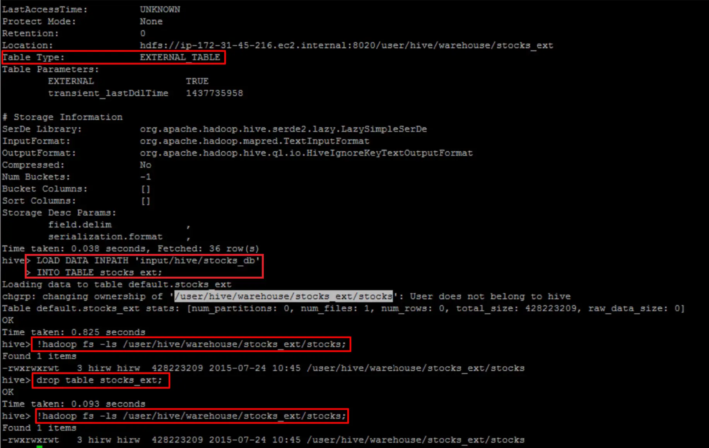

In this article, we're going to take a look to two different types of Hive tables and the significance of each. There are two types of tables in Hive: Managed table and External table. Managed table has full control over its data, i.e. when we drop the table, the tables, data set or files will be also deleted from HDFS. External table, however, does not have full control over its data set, i.e. when we drop the table, the data set is not deleted from HDFS.

Now, the above explanation brings up a very important question: when do we use managed table? And when do we use external table? We would choose to use managed table when Hive is the only application using the data set, whereas we would choose to use external table when the underlying data set pointed by Hive table is shared by many applications like Pig, MapReduce jobs, etc. When multiple applications are interested in a data set, would we keep multiple copies of the same data set one for each application? No, we wouldn't because most likely our data set will be in the magnitude of gigabytes or terabytes and so it does not make sense to keep multiple copies of the data set. That means when a single copy of the data set is shared between application, we don't want Hive to delete the data set when the table is dropped.

Now, we understand the difference between managed table and external table. Let's see how to create a managed table and how to create an external table. By default, when we create a table, it is a managed table. If we want to create an external table, we have to specify the keyword `EXTERNAL` when creating the table.


Assume that the stocks table from "Behind a Hive table" article is already on our cluster. So, we can describe formatted on the stocks table, `DESCRIBE FORMATTED stocks_db.stocks` and check out the table type on the output screen shown in the above screenshot. It says `MANAGED_TABLE`, which means our stocks table under `stocks_db` database is a managed table.


Let's check out the data set under the location attribute with the command `!hadoop fs -ls /user/hive/warehouse/stocks_db.db/stocks;`. We can see the data set under the location specified in the location attribute in HDFS. Now what we're going to do is we're going to drop the table and check the location again let's drop the table using the drop table command `drop table stocks_db.stocks;`. The table is now dropped now and check the location again. The above screenshot shows `No such file or directory`, which means that data set is now dropped as well. If anyone tries referring to this data set, it fails since we deleted the data set. That is the behavior of managed table.

Let's now look at the external table. The following command is the create table syntax to create an external table. The `EXTERNAL` keyword is mentioned in the syntax.

```sql
CREATE EXTERNAL TABLE IF NOT EXISTS stocks_ext (
	exch string,
	symbol string,
	ymd string,
	price_open float,
	price_high float,
	price_low float,
	price_close float,
	volume int,
	price_adj_close float
) ROW FORMAT DELIMITED FIELDS TERMINATED BY ',';
```

Let's execute the command and do a described formatted command on this table.



As shown in the screenshot, the table type is mentioned as external table. Next, we can load this table using this load instruction `LOAD DATA INPATH 'input/hive/stocks_db' INTO TABLE stocks_ext;`. The table is now loaded, let's verify the location of this table before, `!hadoop fs -ls /user/hive/warehouse/stocks_ext/stocks;` and after dropping the table, `DROP TABLE stocks_ext;`. Now that the table is dropped and let's do a listing on the location again. The screenshot show that the data set which is exactly what we expect to see with external table.

Knowing when to use managed table and when to use external table is crucial. Question: Does using the location attribute when creating a table change the behavior of manage table or external table? The answer is no. When creating a table in Hive, by default, Hive creates a directory for the table under Hive's warehouse directory. For some reason, we don't want the tables directory to be under the warehouse directory, we can override the location using the location attribute during table creation. Another scenario, whereas a Pig script runs every night in our cluster and creates a data set in a HDFS location. Now we want Hive to use this data set. In this case, we would use an external table and use the location attribute to point to the location which is populated by Pig. In this scenario, we could have used managed table as well but external table is more appropriate because this location is also being used by the Pig script to populate the data set. Therefore, we won't drop the location when we decide to drop the table since the location is also being shared by Pig.

In summary, there are two types of tables in Hive: managed table and external table. When a manage table is dropped, the underlying data will also be dropped. But dropping an external table doesn't drop the data set. Thus, the external table is a good choice when the Hive table is pointing to a data set which is shared by other applications.
