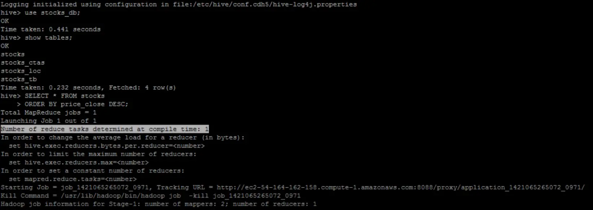
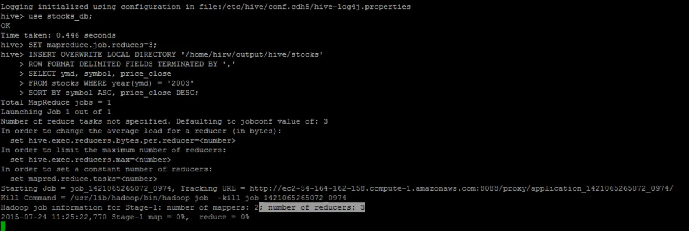

These are very interesting concepts which are about ordering records in a data set. What is so special about ordering? If we want to order the records in the stocks data set by closing price in descending order, we can write a simple query like

```sql
SELECT *
FROM stocks
ORDER BY price_close DESC;
```

However, this simple `ORDER BY` statement has some performance implication. When executed this query, the first thing we will notice in the below output snapshot is `Number of reduce tasks determined at compile time` equals to `1`.



Why Hive is choosing to run the `ORDER BY` statement with just one reducer? Because `ORDER BY` does a global ordering of all records in the data set, which means to do a global ordering all the records in our data set must be sent to one reduce. This is a serious problem if we have a very large data set and when all the records in our data set are sent to one reduce, this will lead to memory issues and the execution time of this reducer could be off the charts. Therefore, the solution is to use multiple reducers instead of just one.

We can set the number of reducers that we would like to use using the property `mapreduce.job.reduces` in our Hive session. For example, let's set the number of reducers to 3 and run the `ORDER BY` query again. The output shows in the following snapshot.


Again, we are seeing that the number of reduced task is set to 1. Since the `ORDER BY` does global ordering of our data set the number of reducers will be always forced to one even when we specify to more than one reducer. So, what is the real solution here? The answer is `SORT BY`. When using `SORT BY`, it uses multiple reducers. Let's consider the following query:

```sql
SELECT ymd, symbol, price_close
FROM stocks
WHERE year(ymd) = '2003'
SORT BY symbol ASC, price_close DESC;
```

For simplicity, we are filtering only records from year 2003 and we are sorting the records by symbol in ascending order and closing price in descending order. To review the results from this query execution, we are storing the results of the query in the local file system using the following `INSERT` command:

```sql
INSERT OVERWRITE LOCAL DIRECTORY '/home/dungho/output/hive/stocks'
ROW FORMAT DELIMITED FIELDS TERMINATED BY ','
SELECT ymd, symbol, price_close
FROM stocks
WHERE year(ymd) = '2003'
SORT BY symbol ASC, price_close DESC;
```

We're saying `INSERT OVERWRITE LOCAL DIRECTORY` and we are giving the location in the local file system and we're also saying the output has to be delimited by comma. Now the output of this select statement will be written into this directory delimited by comma. Before we execute this query, let's set the number of reducers to 3.



As shown in the above screenshot, the number of reducers is now set to 3. When the job is complete, the output of this job is copied to the local directory. We can go to the local directory and review the output. There are three files where are one for each reducer. If we open one of these files, we can see the records in this file are sorted by symbol first in ascending order and then sorted by closing price in descending order.

Unfortunately, there is a problem. Let's pick the symbol `B3B` in the first file, we can find records for `B3B` in this file. And we can also find the records for `B3B` in other files.In this second file as well as the third file, we see the records are sorted by symbol first in ascending order and then sorted by closing price and descending order. In other words, the problem is the symbols from the first file also appearing in other files. They're not duplicates, it is just that the records for the same symbol are distributed between the reducers and then sorted in each reducer. That is not ideal. For true logical ordering, we want all the records from the same symbol to go to the same reducer and end up in one file.

How do we make all the records from the same symbol go to the same reducer and finally end up in the same file? The answer is `DISTRIBUTE BY` along with `SORT BY`. In the `DISTRIBUTE BY` clause, it specifies the column that should be treated as the key for the reducers. In our case, we would like all the records for the same symbol to go to the same reducer, so we will specify the symbol column in `DISTRIBUTE BY`. The previous query is revised as follows:

```sql
INSERT OVERWRITE LOCAL DIRECTORY '/home/dungho/output/hive/stocks'
ROW FORMAT DELIMITED FIELDS TERMINATED BY ','
SELECT ymd, symbol, price_close
FROM stocks
WHERE year(ymd) = '2003'
DISTRIBUTE BY symbol
SORT BY symbol ASC, price_close DESC;
```

When executing this query, we can see the number of reducers is set to 3. And we may also notice, since we are using three reducers as opposed to just one, our job is completing much faster. When the job is complete, let's review the output in the output location and there are three files again. If we open the first file, the records are now sorted by symbol in ascending order and then sorted by closing price in descending order as exactly expected. Moreover, we can verify that each symbol is written into only one file. For example, let's pick up the same symbol that we used before `B3B` and make sure that the records for symbol `B3B` is only present in one file, in this case, file number one. Thus, if we go to file number two and file number three and check if whether there are records for `B3B`, technically, we should not see records for `B3B` in any other files since it is already present in file number one because we use `DISTRIBUTE BY` along with `SORT BY`.

Now the records are not only sorted properly but also do not see overlapping results between files. One last thing, if we have the same set of columns in `SORT BY` and `DISTRIBUTE BY` and we're sorting the records in ascending order, we can replace `SORT BY` and `DISTRIBUTE BY` with `CLUSTER BY`. For example, the following query, in which we have `DISTRIBUTE BY symbol` and `SORT BY symbol`, can be replaced `SORT BY` and `DISTRIBUTE BY` with `CLUSTER BY` as shown in the last query. Both two queries are essentially the same and will give the same output.

```sql
SELECT ymd, symbol, price_close
FROM stocks
DISTRIBUTE BY symbol
SORT BY symbol ASC;
```

```sql
SELECT ymd, symbol, price_close
FROM stocks
CLUSTER BY symbol;
```

In summary, `ORDER BY` does global ordering and will always use one reducer, which is problematic because it will lead to performance problems. We can use `SORT BY` along with `DISTRIBUTE BY` to use multiple reducers and send records from a certain key column to the same reducer. Finally, `CLUSTER BY` can be used when the same set of columns are used in `SORT BY` and `DISTRIBUTE BY`.

