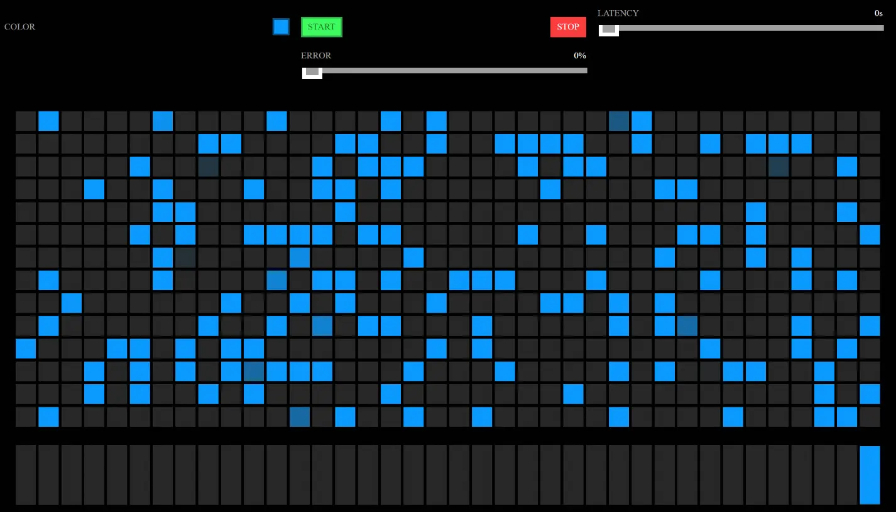
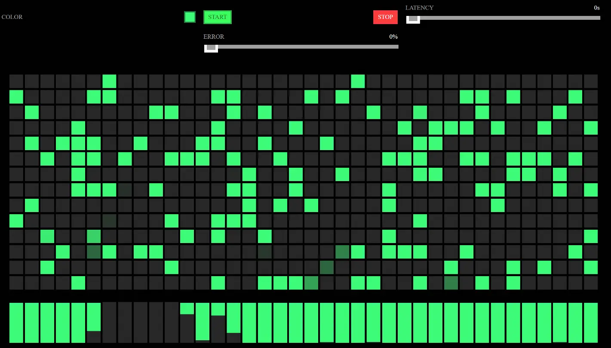
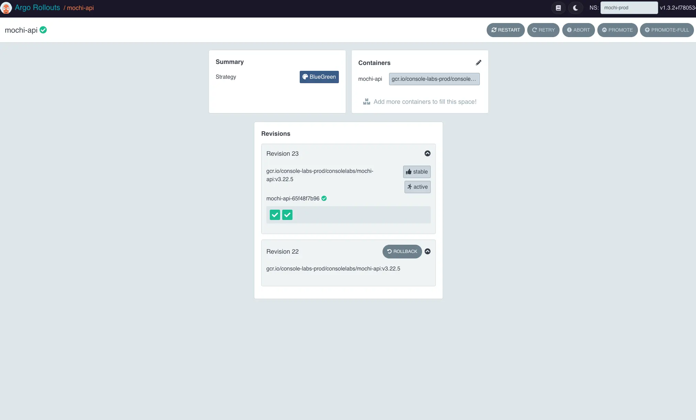

*Our team has always faced some bit of friction when deploying apps for our clients. We’ve known about blue-green deployments for a while and were recently given the chance to evaluate and demonstrate them for one of our Discord bot projects.*

## Applying Blue-green deployment for Mochi Bot

Introducing [Mochi Bot](https://mochi.gg/) to the Web3 space, our team has developed a flexible and user-friendly product with features like NFT rarity queries, sales alerts on Discord and Twitter, and showing various tips. To enhance user experience and streamline deployment, we had the chance to implement [blue-green deployment](https://radar.d.foundation/Blue-green-deployment-a93ea5c3d4d8439ba8701aec57d7ea3c) for the Mochi Bot application. Below is our case study that evaluates the cost and practicality of this deployment strategy in our current infrastructure.

## **Current Infrastructure & Implementation Plan**

Mochi Bot runs on a Kubernetes infrastructure managed by ArgoCD, with two pods. By implementing blue-green deployment, we aim to eliminate downtime and ensure consistent updates across pods. To achieve this, we set up two identical production environments (blue and green) and followed these steps:

1. Evaluate current infrastructure and identify prerequisites.
1. Prepare Kubernetes manifests for blue and green environments.
1. Apply new configurations to clusters.
1. Test deployment process, including traffic switching and rollback procedures.

## **Preparation & Resource Definition**

To implement blue-green deployment in Kubernetes, we needed to define the application resources and the rollout strategy. We defined the application resources using three YAML files:

```plain_text
.
└── app/
    ├── bluegreen-rollout.yaml
    ├── ingress.yaml
    └── service.yaml
```

Before that, setting up [Argo Rollouts](https://github.com/argoproj/argo-rollouts) is a prerequisite to enable blue-green deployment capability:

```bash
kubectl create namespace argo-rollouts
kubectl apply -n argo-rollouts -f https://github.com/argoproj/argo-rollouts/releases/latest/download/install.yaml
```

The blue-green update strategy is applied to define the release through the `bluegreen-rollout.yaml` file.

```bash
# bluegreen-rollout.yaml
apiVersion: argoproj.io/v1alpha1
kind: Rollout
metadata:
  name: mochiapp
  labels:
    app: mochiapp
spec:
  replicas: 1
  revisionHistoryLimit: 1
  selector:
    matchLabels:
      app: mochiapp
  template:
    metadata:
      labels:
        app: mochiapp
    spec:
      containers:
        - name: myapp
          image: argoproj/rollouts:blue
          imagePullPolicy: Always
          ports:
            - name: http
              containerPort: 8080
  strategy:
    blueGreen:
      autoPromotionEnabled: false
      activeService: mochiapp
      previewService: mochiapp-preview
```

The `bluegreen-rollout.yaml` file is structured similarly to a typical deployment file, but with the added `strategy` section. Here, we specified the `activeService` to update with the new template hash during promotion (required), and the `previewService` to update with the new template hash before (optional).

Next, we created the `ingress.yaml` and `service.yaml` files, which contained the respective configurations for ingress and service resources:

```bash
# ingress.yaml
apiVersion: networking.k8s.io/v1
kind: Ingress
metadata:
  name: mochiapp
  annotations:
    cert-manager.io/cluster-issuer: letsencrypt-prod
spec:
  ingressClassName: nginx
  tls:
    - hosts:
        - mochiapp.bluegreen.domain
      secretName: mochiapp.bluegreen.domain-tls
  rules:
    - host: mochiapp.bluegreen.xyz
      http:
        paths:
          - pathType: Prefix
            path: "/"
            backend:
              service:
                name: mochiapp
                port:
                  name: http

---
apiVersion: networking.k8s.io/v1
kind: Ingress
metadata:
  name: mochiapp-preview
  annotations:
    cert-manager.io/cluster-issuer: letsencrypt-prod
spec:
  ingressClassName: nginx
  tls:
    - hosts:
        - preview.mochiapp.xyz
      secretName: preview-mochiapp.bluegreen.domain-tls
  rules:
    - host: preview-mochiapp.bluegreen.domain
      http:
        paths:
          - pathType: Prefix
            path: "/"
            backend:
              service:
                name: mochiapp-preview
                port:
                  name: http
```

```bash
# service.yaml
apiVersion: v1
kind: Service
metadata:
  name: mochiapp
  labels:
    app: mochiapp
spec:
  selector:
    app: mochiapp
  ports:
    - name: http
      port: 80
      targetPort: http
  type: ClusterIP

---
apiVersion: v1
kind: Service
metadata:
  name: mochiapp-preview
  labels:
    app: mochiapp
spec:
  selector:
    app: mochiapp
  ports:
    - name: http
      port: 80
      targetPort: http
  type: ClusterIP
```

## Applying Resources to the Cluster and Testing

We applied the resource files to the Kubernetes cluster using `**kubectl apply**` commands. The application was deployed to the active environment and could be viewed on the production domain - `mochiapp.bluegreen.domain`.

```bash
kubectl apply -f app/bluegreen-rollout.yaml
kubectl apply -f app/service.yaml
kubectl apply -f app/ingress.yaml
```



When releasing a new version, we changed the image of the application and applied the changes to the cluster. Argo rollouts created a new ReplicaSet with the new image and initiated the rollout of the updated version in the preview environment, accessible at the preview domain - `preview-mochiapp.bluegreen.domain`.

```bash
# bluegreen-rollout.yaml
containers:
 - name: myapp
   image: argoproj/rollouts-demo:green
```

```bash
kubectl apply -f app/bluegreen-rollout.yaml
```

Once the updated application version was thoroughly tested, we promoted it to the active environment using a specific command. The updated application was then accessible on the active environment in the blue domain.

```bash
kubectl argo rollouts promote mochi
```

With the deployment complete, the updated application was accessible on the active environment in the blue domain - `mochiapp.bluegreen.domain`.



An alternative would be to utilize the ArgoCD UI for the promotion, as it could prove to be exceptionally helpful for those who may not be able to operate the CLI, including QC, during the release rollout. Additionally, any issues that may arise can quickly be reverted with just the click of the "Rollback" button.




## Conclusion

This case study helped us demonstrate the value of blue-green deployment in reducing downtime, improving user experience, and streamlining the update process for applications like Mochi Bot.

Implementing a blue-green deployment strategy for Mochi Bot proved to be a smooth and hassle-free process. It provided an immediate benefit by eliminating inconsistencies between pod updates during deployment. Thankfully, as a result, the user experience remained seamless and uninterrupted during application updates.

Moving forward, our team plans to integrate [K6](https://radar.d.foundation/k6-ce823e5b593c4850afc1153c1beefbed) for API testing to improve the performance and reliability of Mochi Bot. We aim to establish a quality gate for the green version to ensure that only thoroughly tested and stable releases are deployed to the live environment.

**Come be with us**
We’d love to have you in our next chapter, by all means.

* Discover what we do: [dwarves.foundation](http://dwarves.foundation/)
* Meet our team: [discord.gg/dfoundation](http://discord.gg/dfoundation)
* Join the squad: [careers.d.foundation](http://careers.d.foundation/)

Follow our journey

* Fanpage: [facebook.com/dwarvesf](http://facebook.com/dwarvesf)
* LinkedIn: [linkedin.com/company/dwarvesf](http://linkedin.com/company/dwarvesf)
* Substack: [https://memo.d.foundation/](https://memo.d.foundation/)

