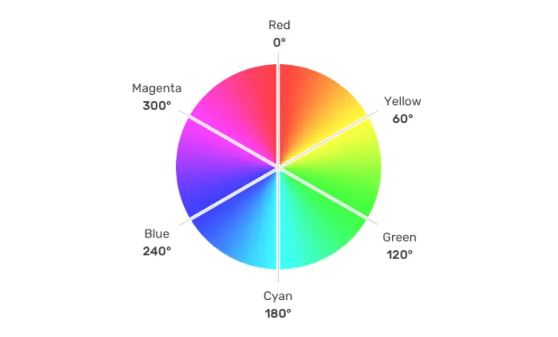

Frontend engineers use Hexadecimal color codes to represent colors, but they have some limitations:

- Hexadecimal color codes are difficult to write and adjust, requiring the use of a third-party application to get right.
- Hexadecimal color codes can be difficult to remember and use, especially for designers.

HSL is the answer to resolving all of the painful points.

## What is HSL?

**HSL** stands for **hue**, **saturation**, and **lightness**. It’s based on the RGB color wheel. Each color has an angle and a percentage value for the saturation and lightness values.

- **Hue**: Think of a color wheel. Around 0<sup>o</sup> and 360<sup>o</sup> are reds. 120<sup>o</sup> is where greens are and 240<sup>o</sup> are blues. Use anything in between 0-360. Values above and below will be modulus 360.

  

- **Saturation**: 0% is completely desaturated (grayscale). 100% is fully saturated (full color).

  

- **Lightness**: 0% is completely dark (black). 100% is completely light (white). 50% is average lightness.

  

## Using HSL

### Darker/lighter colors

Imagine you're creating a button component and you want it to appear darker on hovering to increase its contrast. You can do this easily with the help of HSL.


```css
:root {
  /* brand color: #E13F5E */
  --primary-h: 349;
  --primary-s: 73%;
  --primary-l: 56%;
}

.button {
  background-color: hsl(var(--primary-h), var(--primary-s), var(--primary-l));
}

.button:hover {
  --primary-l: 40%;
}
```

### Color palette

By altering the `lightness`, we can create a set of shades for a color that can be used throughout the UI where possible.


## HSL transparency (HSLa)

It works exactly the same as with RGB, just add `alpha` channel with a value from 0 to 1. 0 is fully transparent. 1 is fully opaque. 0.5 is 50% transparent.

```css
hsla(349, 73%, 56%, 0.5)
```

## References

- https://css-tricks.com/hsl-hsla-is-great-for-programmatic-color-control/
- https://www.smashingmagazine.com/2021/07/hsl-colors-css/
- https://tsh.io/blog/why-should-you-use-hsl-color-representation-in-css/

