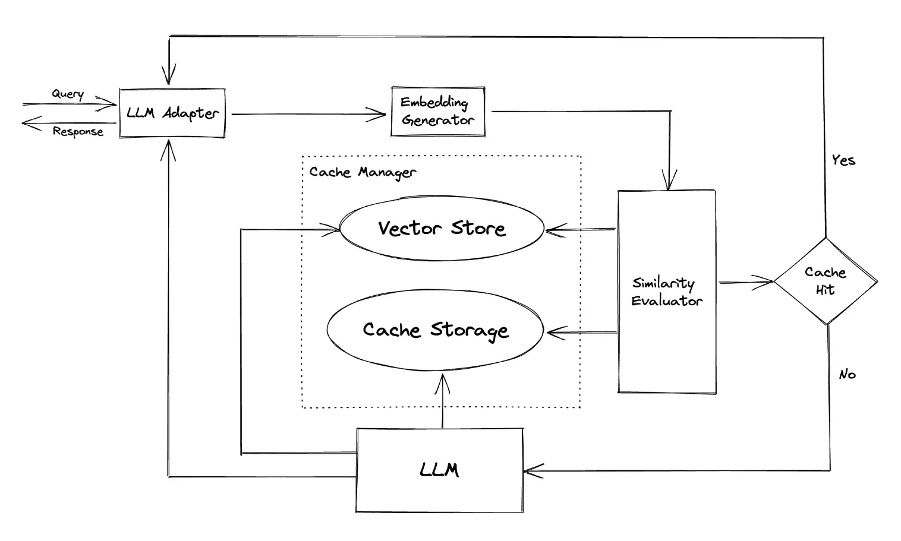

It's quite fascinating to see the increasingly pivotal role that Large Language Models (LLMs) are playing in various applications, covering the spectrum from natural language processing tasks to predictive typing, and more. An undeniable challenge, however, comes in the form of processing speed and computational cost associated with these models. But there's light at the end of the tunnel with a ground-breaking approach known as query caching, which holds potential for drastically transforming LLMs' efficiency and cost-effectiveness.

The ingenuity of this approach rests on the use of semantic vector databases, capitalizing on the semantic correlations among queries. To put it in practical terms, when an LLM processes a query and gives an answer, the response is stored away or 'cached' for potential use in the future. Should a subsequent query share semantic similarities with an earlier one, the system can simply pull out the cached answer, eliminating the necessity for additional, laborious computations.

To picture this in a real-life context, imagine an e-commerce scenario. When a customer asks an AI assistant, "What are the store's operating hours?", the AI's response gets cached. Later, if another customer poses a semantically similar question like "When does the store open and close?", the system uses the cached answer, sidestepping another processing cycle. The effectiveness of this method in reducing computational time and resources is impressive.

A key advantage of this process is the ability to customize it to individual preferences by setting a semantic similarity threshold. This fine-tuning potential ensures a beneficial trade-off between efficiency and precision in handling queries.

The advantages of this strategy are manifold, with substantial savings in computational and financial resources being just one of the perks. It's a game-changer in tackling the ongoing speed issue that plagues large language models. Plus, the broad-reaching potential of this method for any application involving LLMs underscores its versatility across various sectors.

## References

- https://github.com/zilliztech/GPTCache
