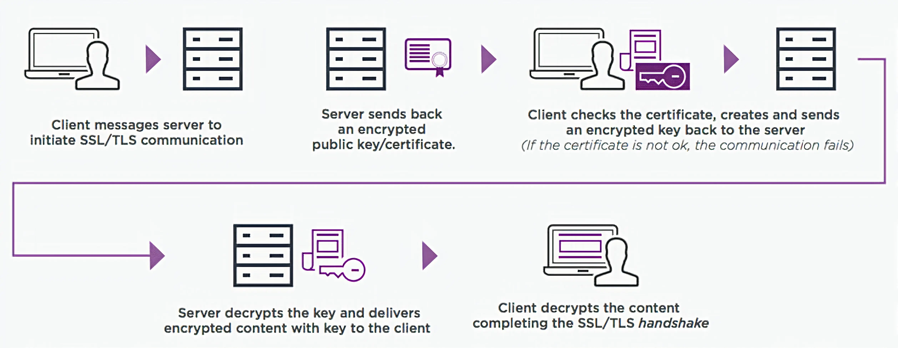

Security plays a vital role in software, maybe in any field of work. But when the coverage of software expands, the importance of security gets taken for granted, as it's embed and supported in frameworks and other low-level layers of the tech stacks. Hence, developers tend to spend time on the top-level layers. They buy in the fact that frameworks and libraries solve security issues. Consequently, security stays in a black box.

The lack of knowledge leads to the failure of security mechanisms. Many developers out there still go through the day, letting the most widely-used security technologies work under-the-hood.

So we guess it's safe to raise awareness on this. Starting from the basic summary of Blockchain, SSH and SSL. Blockchain has dominated some aspects of technology security for the past few years. It was clearly told through the way it got applied in many different industries. Finance, agriculture, logistics and so on.

Plus, if you are interested in security, poking around **capture the flag (CTF)** is a good start.

## SSH

SSH, Secure Shell or Secure Socket Shell, is a network protocol that provides a secure channel to operate services over the unsecured network. It's used in authenticating to send remote command, log in or grant permission, ..etc.

Whenever a computer sends data to the network with SSH integrated, SSH automatically encrypts it. When the data reaches its intended recipient, SSH automatically decrypts (unscrambles) it. The result is transparent encryption: users can work while their communications are safely encrypted on the network.

## SSL

SSL is a data transfer security protocol. And in the web hosting industry, the SSL term is often used as a synonym for HTTPS, which is not entirely correct. The difference between SSL and https is rather significant.

SSL protection is implemented through two main mechanisms: authentication and encryption. Scientifically, SSL Protocol uses asymmetric cryptography to authenticate exchange keys, symmetric encryption to preserve confidentiality, and message authentication codes to ensure message integrity.

## Blockchain Security

This part covers the fundamental theory of how blockchain works and gets applied. Blockchain technology is utilized in the data structure as it prevents data from being exploited for bad purposes. In short, blockchain works when data immutability and security are highly valuable. Most likely notice in cryptocurrency, blockchain security avoids digital money from being destroyed or duplicated. A decentralized public ledger.

Blockchain uses blocks to store pieces of information. Each block is time-stamped and connected to the one generated before it generated time. There are three most popular feature that makes blockchain more secured:

* Decentralization: Copy of the blockchain ledger are stored and updated on each node-computer in the network, meaning that there is no central authority to make decisions
* Consensus: The ability of nodes agrees on the true state of the network to ensure that the rules of the system are being followed and all parties involved agree on the current network’s state.
* Immutability: Immutable means that something is unchanging over time or unable to be changed.

## References

* **[1] "SSH Reference - Unix Tutorial."** [https://www.unixtutorial.org/reference/ssh](https://www.unixtutorial.org/reference/ssh). Accessed 30 Jul. 2020.
* **[2] "How Does SSL Work? | Entrust Datacard."** [https://www.entrustdatacard.com/pages/ssl](https://www.entrustdatacard.com/pages/ssl). Accessed 30 Jul. 2020.
* **[3] "How does the blockchain work? • Infinity Economics Platform."** [https://web.infinity-economics.org/how-does-the-blockchain-work/](https://web.infinity-economics.org/how-does-the-blockchain-work/)****. Accessed 30 Jul. 2020.

