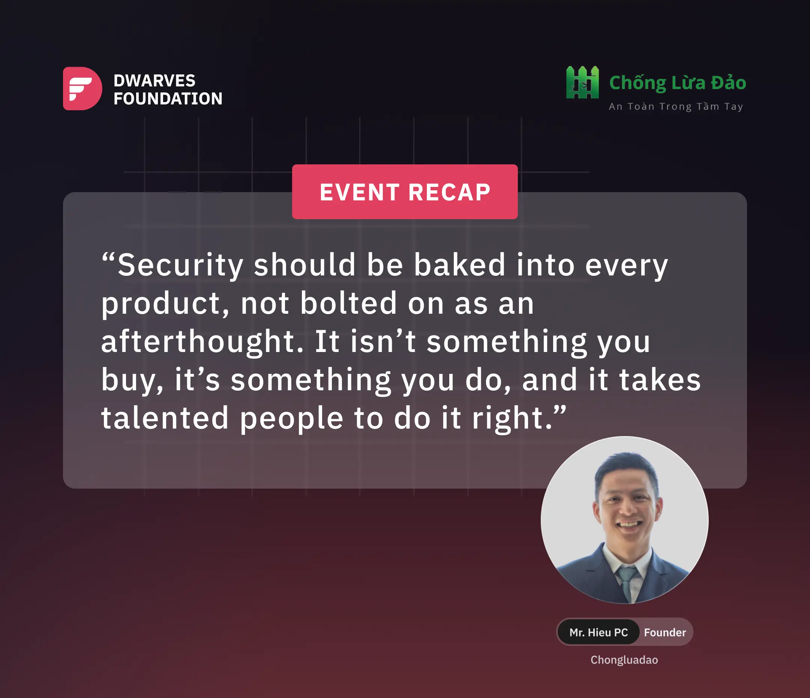

*Hosted by Thanh Pham - Engineering Manager, Dwarves had a great time with the best minds in cybersecurity- Mr. Hieu PC to share his knowledge and experience. As someone who is always looking to improve skills, this event is extremely valuable. We learned a lot about the different elements of cybersecurity and how to better protect our code.*

Hieu PC was a pro ex-hacker who made headlines and is now a Security Expert at Vietnam's National Cybersecurity Centre (NCSC). He leads the organization to build a robust ICT security infrastructure to protect Vietnam from external and internal attacks. One of the insiders who worked actively in preventing attacks by cyber terrorists on Vietnam's Internet Infrastructure and a founder of [chongluadao.vn](http://chongluadao.vn/) (the largest online community in Vietnam on hacking and ethical hacking).

### Produce first, secure later?

There is a common misconception amongst programmers that product development is a one-time event. Once the product is developed, it will be secure and there will be no need to worry about it being hacked. This could not be further from the truth.

Product development is an ongoing process that should never be considered complete. As new threats emerge, security vulnerabilities are discovered and new features are added, the product must continue to evolve to stay ahead of the curve. Failing to do so can have serious consequences for the project, the client, and the company.

### Elements of cybersecurity

Cybersecurity is divided into four elements: credibility, intellectual property rights, computer abuse, and competence. Protecting customer data will increase the company's reputation. A company that has leaked user information has a very high rejection rate (30%). In this day and age, safeguarding your online presence is essential to maintaining a good reputation.

Customers are becoming more and more aware of the importance of their data security, and they will not hesitate to take their business elsewhere if they feel their information is at risk. By investing in a strong cybersecurity infrastructure, you can give your customers the peace of mind they need to stay with you for the long haul.

### Security should be built in, not bolt-on

Security should be baked into every product, not bolted on as an afterthought. Too often, companies focus on making money and growth and forget about the importance of security. This guide will outline some of the most important aspects of security that businesses need to keep in mind.
Firstly, it is essential to have security measures in place from the very beginning. It is much easier and more cost-effective to prevent attacks than it is to try to fix things after an attack has already happened.

Secondly, always check for security errors and vulnerabilities. Even the most well-protected systems can have weak points that hackers can exploit.

Thirdly, build a strong infrastructure. A solid foundation will make it much harder for attackers to penetrate your system.

Finally, all important accounts should enable 2-step security. In today's digital age, a single password is simply not enough to protect your data.

### The most important thing for an engineer is to be up-to-date on the latest security standards

As a programmer, it is essential to be up-to-date on the latest security standards. Security should be a top priority for any programmer, as it is essential in keeping information safe. There are many ways to improve security, and it is important to learn as many of them as possible.

One way to stay informed about security standards is to regularly conduct core reviews. These reviews help identify potential security risks and vulnerabilities. Another way to improve security is to file centered on functional requirements. This ensures that all aspects of the project are properly secured.

Additionally, programmers should provide guidance on security for the project, apply security at each stage of product development, and don’t forget to keep learning. By following these best practices, programmers can help keep their projects secure and ensure that information remains safe.

The Teach Event #5 with Hieu PC was a great success, with everyone in attendance has received a wealth of useful information. Here is hoping that what we shared resonated, and believing that everyone left the session with some new and useful tips that theory can apply to their work and personal lives.

Hope to see you again at future events that promise to be even more exciting.

📩 Reach out to Mr. Hieu PC and chongluadao: [chongluadao.vn](http://chongluadao.vn/) or [info@chongluadao.vn](mailto:info@chongluadao.vn)

📍 We’re glad to hear your favorite topics at: [https://discord.gg/dfoundation](https://discord.gg/dfoundation)

📍 For those who missed the session, please visit: [https://www.youtube.com/watch?v=8z33k8A-97g](https://www.youtube.com/watch?v=8z33k8A-97g)

---

*Dwarves Foundation partners with communities and experts to bring real stories, professional points of view, and live-case practices in the tech talk series that accelerates your software career.*

